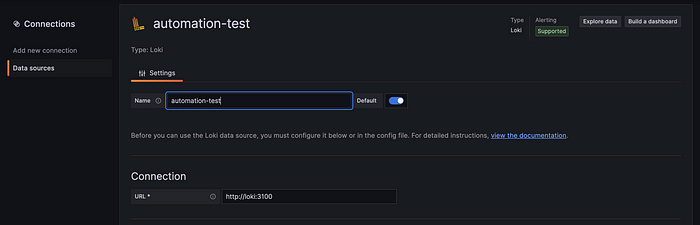
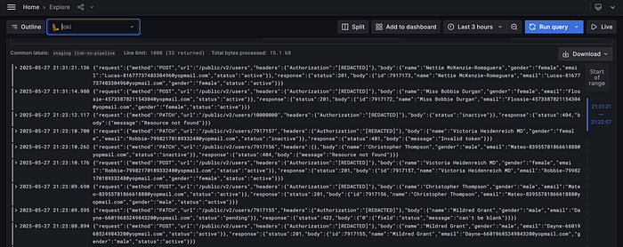

+++
date = 2025-05-27
title = "使用 Grafana Loki 实现 Playwright API 日志集中管理"
description = "https://medium.com/@indraaristya/centralized-playwright-api-logs-with-grafana-loki-368c21a76aba"
authors = ["乙醇"]
[taxonomies]
tags = ["playwright进阶", "翻译"]
[extra]
math = false
image = "banner.jpg"
+++

**Playwright** 是一款强大的端到端和 API 测试工具，但在 CI 流水线中，有时我们写好的场景会出现失败，而搞清楚失败的原因却令人头疼。试想一下，如果你能将每一次请求和响应都记录到像 **Grafana Loki** 这样可搜索的集中系统中，会不会更容易调试？  
这篇文章将向你展示如何将 Loki 日志集成进你的 Playwright API 测试中，让你无需延长测试时间也能更快定位问题。

## 为什么要记录 API 测试日志？

API 测试失败的原因多种多样，比如授权头无效、请求体格式错误，或是后端本身出现波动。在本地单个运行场景时，我们可以很容易地定位问题；但一旦进入流水线并行执行，问题就变得难以排查了。  
因此，**记录 API 测试数据显得尤为重要**。

通过记录这些日志，我们可以更快识别错误并解决它，提升调试效率。

## 搭建 Loki 和 Grafana

Loki 是一个专为日志聚合设计的系统，由 Grafana Labs 开发，因此与 Grafana 的集成非常顺畅。Grafana 负责可视化和查询存储在 Loki 中的日志。  
在更新自动化测试中的日志器之前，我们先搭建 Loki 和 Grafana。  
我们可以使用 Docker 来启动 Loki 和 Grafana，官方文档中已经提供了 [docker-compose](https://grafana.com/docs/loki/latest/setup/install/docker/) 示例。

```yaml
version: "3"
services:
  loki:
    image: grafana/loki:2.9.4
    ports:
      - "3100:3100"
    command: -config.file=/etc/loki/local-config.yaml

  grafana:
    image: grafana/grafana:10.3.3
    ports:
      - "3000:3000"
    environment:
      - GF_SECURITY_ADMIN_USER=admin
      - GF_SECURITY_ADMIN_PASSWORD=admin
    depends_on:
      - loki
```

创建 `docker-compose.yml` 文件后，运行 `docker compose up -d` 即可以后台模式启动容器。



### 在 Grafana 添加数据源

打开浏览器访问 _localhost:3000_，使用在 compose 文件中设定的用户名和密码登录。
进入 “Connection → Data Source”，点击“Add New Connection”，选择 **Loki** 作为数据源，URL 填写 [http://loki:3100](http://loki:3100)。

请注意，这里的 `loki` 是 Docker 容器的名称，如果你修改了名字，记得也一起调整。

## 创建日志记录工具

接下来我们为 Playwright 项目创建日志记录工具，项目示例可以在作者仓库中找到。

我们之前直接使用 Playwright 的 `request` 进行请求，需要每次手动添加日志逻辑，重复性太高。现在我们将封装成日志工具函数，并结合请求发送逻辑统一管理：

```ts
const pendingLogs: Promise<void>[] = [];
export function enqueueLog(promise: Promise<void>) {
  pendingLogs.push(promise);
}

export async function flushLogs() {
  await Promise.allSettled(pendingLogs);
  pendingLogs.length = 0;
}
```

日志内容会过滤敏感字段（如 authorization、token、apikey 等），并打上 `REDACTED` 标记：

```ts
function removeAuthOnHeader(
  headers: Record<string, string>
): Record<string, string> {
  const redactedKeys = ["authorization", "api-key", "token"];
  const sanitized: Record<string, string> = {};
  for (const key in headers) {
    sanitized[key] = redactedKeys.includes(key.toLowerCase())
      ? "[REDACTED]"
      : headers[key];
  }
  return sanitized;
}
```

通过 `logApiCallToLoki` 函数将请求和响应发送到 Loki，并支持添加标签（labels），例如环境变量和 job 名称：

```ts
export async function createLoggedApiContext(): Promise<APIRequestContext> {
  const apiContext = await request.newContext();
  const originalFetch = apiContext.fetch;

  apiContext.fetch = async function (url, options) {
    const reqData = {
      method: options?.method || "GET",
      url: url,
      headers: options?.headers,
      body: options?.data || {},
    };

    const response = await originalFetch.call(this, url, options);
    const responseData = { status: response.status() };

    try {
      responseData["body"] = await response.json();
    } catch {
      responseData["body"] = {};
    }

    const logging = logApiCallToLoki(reqData, responseData, {
      environment: process.env.ENV || "local",
    }).catch((e) => {
      console.warn("Loki failed to log the error:", e.message);
    });

    enqueueLog(logging);
    return response;
  };

  return apiContext;
}
```

## 添加全局 Teardown 确保日志发送完成

在测试结束时，我们需要确保所有日志已发送完毕，因此设置 `globalTeardown`：

```ts
import { flushLogs } from "../utils/logQueue";
async function globalTeardown() {
  console.log("Make sure all logs were sent to Loki");
  await flushLogs();
}
export default globalTeardown;
```

别忘了在 `playwright.config.ts` 中设置该 teardown。

## 在测试中使用日志记录工具

现在我们在测试中引入 `createLoggedApiContext` 替代原始 `request`：

**旧版代码：**

```ts
test('创建用户', async ({ request }) => {
  const body = await createUser('valid');
  const response = await request.post(`/public/v2/users`, { headers: header, data: body });
  ...
});
```

**新版代码：**

```ts
test('创建用户', async ({ }) => {
  const body = await createUser('valid');
  const request = await createLoggedApiContext();
  const response = await request.post(`/public/v2/users`, { headers: header, data: body });
  ...
});
```

通过引入 helper，测试请求在发送后会自动构造日志并推送到 Loki，无需手动干预。

## 在 Grafana 中可视化日志

一旦测试执行完成，即可在 Grafana 的 _Explore_ 或 _Dashboard_ 页面查看日志：



日志中包含完整的请求与响应信息，有助于排查错误。

目前示例只添加了 job 和环境名标签，你可以根据需要扩展更多元数据，比如测试用例 ID、构建号、版本等。

## 总结

**调试缺乏可见性是非常痛苦的。**

通过将 **Grafana Loki** 集成进 **Playwright API 测试**，你可以实现集中、结构化、可搜索的日志系统，而不会影响测试性能或执行时间。

无论你在本地还是 CI 中运行测试，这种方式都能帮助你更快定位问题、分析失败原因，并构建更具可观测性的测试流程。

测试，不再只是通过或失败，而是变得可视、可查、可控。

感谢阅读，祝测试顺利！
