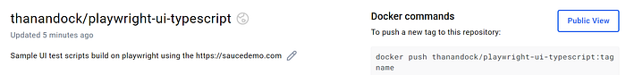
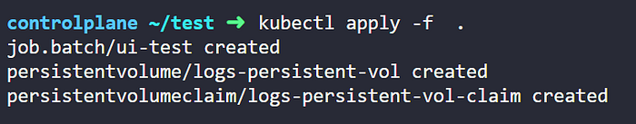
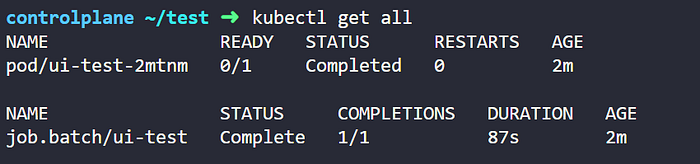
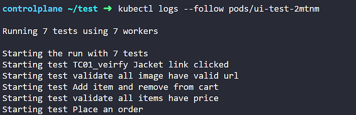
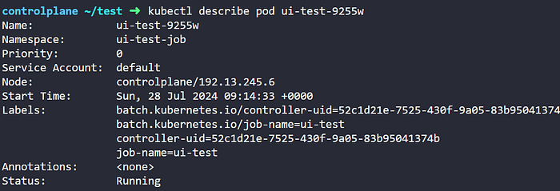
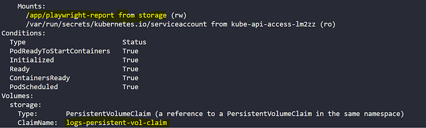
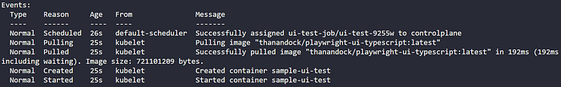
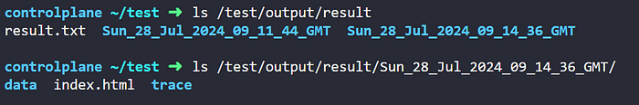

+++
date = 2024-07-28
title = "如何在k8s上跑playwright"
description = "配置不是非常难"
authors = ["乙醇"]
[taxonomies]
tags = ["playwright进阶", "翻译"]
[extra]
math = false
image = "banner.webp"
+++

在DevOps实践中，代码通常部署在多个环境中，如开发、QA、预发布等。当使用Kubernetes在不同命名空间管理这些环境时，复杂度会迅速增加。为解决这个问题，可扩展的全面测试方案变得至关重要。本文将探讨Playwright和Kubernetes的强大组合，它将容器化浏览器测试带到现代DevOps实践的前沿。让我们一起来实践一下。

## 设置

要在Kubernetes中启动容器化的Playwright测试，请按以下步骤操作。本演示使用了一个简单的Playwright UI脚本，可参考[这个仓库](https://github.com/thananauto/playwright-ui-typescript)。

### 创建Dockerfile

让我们创建一个包含所有浏览器和Playwright依赖的Dockerfile：

```dockerfile
# 使用任意Node基础镜像
FROM node:20-bookworm

# 复制当前工作目录，请添加.dockerignore以忽略不必要的文件
WORKDIR /app
COPY . /app

RUN npm cache clean --force
# 仅安装Chromium浏览器及其依赖
RUN npm install
RUN npx -y playwright install --with-deps chromium
ENTRYPOINT ["/bin/sh"]
```

这里我们只添加了Chromium浏览器的依赖。

### 构建并推送镜像到Docker Hub

```bash
#登录Docker Hub
docker login -u="${DOCKER_USERNAME}" -p="${DOCKER_PASSWORD}"

# 构建Docker镜像
docker build -t playwright-ui-typescript .

# 为容器仓库标记镜像
docker tag playwright-ui-typescript ${DOCKER_USERNAME}/playwright-ui-typescript:latest

# 推送镜像到容器仓库
docker push ${DOCKER_USERNAME}/playwright-ui-typescript:latest
```

镜像推送到Docker Hub后，请在[hub](https://hub.docker.com/)上检查。



### 创建Kubernetes清单文件

为了在Pod内执行测试，我们需要一个存储空间来获取和收集测试结果，即使节点或Pod不可用。为此，我们需要设置持久卷（PV）和持久卷声明（PVC）。

#### 1. 持久卷（PV）

持久卷清单支持多种卷映射选项，包括CSI、iSCSI、HostPath、NFS、FC和基于主机的存储。让我们看一个例子：

```yaml
apiVersion: v1
kind: PersistentVolume
metadata:
  name: logs-persistent-vol
  labels:
    type: local
spec:
  storageClassName: manual
  capacity:
    storage: 256Mi
  volumeMode: Filesystem
  accessModes:
    - ReadWriteMany
  persistentVolumeReclaimPolicy: Retain
  hostPath:
    path: "/test/output/result"
    # 如果主机上不存在此路径，将自动生成
```

注意：持久卷不属于集群中的任何命名空间。

#### 2. 持久卷声明（PVC）

这个持久卷声明（PVC）从主机请求存储资源，并将分配的卷映射到Pod，实现数据持久化和容器内访问。

```yaml
apiVersion: v1
kind: PersistentVolumeClaim
metadata:
  namespace: ui-test-job
  name: logs-persistent-vol-claim
spec:
  storageClassName: manual
  resources:
    requests:
      storage: 256Mi
  volumeMode: Filesystem
  accessModes:
    - ReadWriteMany
```

注意：请检查集群的存储类名称。

#### 3. Job

Kubernetes中的Job类似于Pod，但有特定用途。与可能失败并重启的Pod不同，Job确保任务（如执行测试）只完成一次，无论Pod的状态如何。让我们看看Job清单文件：

```yaml
apiVersion: batch/v1
kind: Job
metadata:
  namespace: ui-test-job
  name: ui-test
  labels:
    app: playwright
    name: ui-jobs
spec:
  # 任务完成或结束后自动删除的等待时间
  ttlSecondsAfterFinished: 100
  # 将backoffLimit设为0，否则此任务将持续执行直到状态为完成或结束
  backoffLimit: 0
  template:
    metadata:
      name: ui-test-job
    spec:
      restartPolicy: Never
      containers:
        - name: sample-ui-test
          image: thanandock/playwright-ui-typescript:latest
          args: ["-c", "npx playwright test"]
          volumeMounts:
            - name: storage
              mountPath: /app/playwright-report
              # 容器内的报告生成路径
      volumes:
        - name: storage
          persistentVolumeClaim:
            claimName: logs-persistent-vol-claim
```

### 部署到Kubernetes

现在是时候将这些Kubernetes清单部署到集群了。在此之前，将所有文件保存在一个文件夹中，然后运行以下命令：

```bash
# 创建命名空间
kubectl create namespace ui-test-job

# 将当前上下文设置为新创建的命名空间
kubectl config set-context --current --namespace=ui-test-job

# 部署所有清单文件
kubectl apply -f .
```



成功创建清单文件

### 监控和获取结果

通过执行`kubectl get all`命令检查任务状态



任务的整体状态

使用`kubectl logs --follow pods/<name>`查看容器日志



显示测试执行的容器日志

当Pod崩溃、初始化错误或配置错误时，`kubectl describe pod <name>`命令非常有用：



描述Pod状态

容器的卷通过持久卷声明与主机持久卷映射



容器卷通过PVC挂载到主机卷

容器内发生的事件列表



Pod内发生的事件列表

在下面的截图中，我们可以看到节点中不同部署的不同时间戳文件夹，即使Pod在一段时间后被删除，这些结果也将持久保存。



即使Pod被删除，HTML结果仍在主机上可用

## 参考资料：

* 示例代码可在[这里](https://github.com/thananauto/playwright-ui-typescript.git)找到。
* 有关Docker化Playwright镜像，请参考[文档](https://playwright.dev/docs/docker)。

## 结论

通过将Playwright容器化并部署在Kubernetes上，团队可以实现可扩展、隔离且高效的测试环境。这种方法不仅简化了测试过程，还与现代CI/CD管道无缝集成，确保以更快的速度实现高质量的发布。

祝学习愉快！🚀

## 来源

[原文](https://medium.com/@thananjayan1988/containerized-browser-testing-with-playwright-on-kubernetes-09743e5d2362)