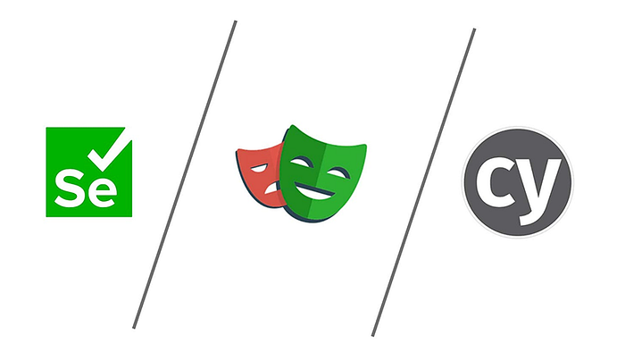
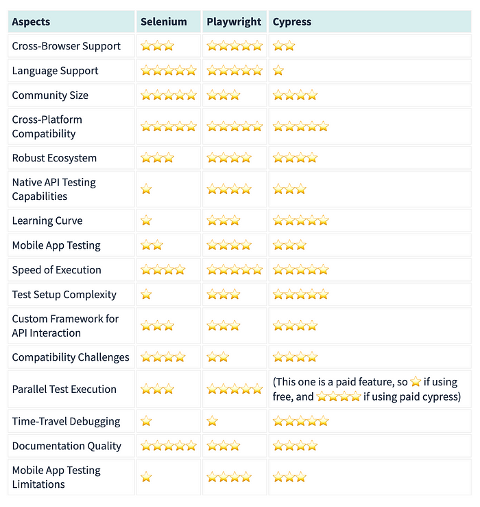

+++
date = 2023-11-21
title = "三大自动化测试工具 playwright/selenium/cypress 的终极对比"
description = "决战自动化测试巨头：Playwright vs. Selenium vs. Cypress 对决"
authors = ["乙醇"]
[taxonomies]
tags = ["playwright进阶", "翻译"]
[extra]
math = false
image = "banner.jpg"
+++

作者：Franco Kleinerman

在不断发展的软件开发领域，自动化测试已成为确保应用程序质量和可靠性的关键组成部分。但是，面对众多可用的自动化测试工具，为您的项目选择合适的工具可能是一项艰巨的任务。

本文将介绍 Playwright、Selenium 和 Cypress 这三个强大且广泛使用的自动化测试工具。在这份全面指南中，我们将探讨这三个工具，每种工具都有其独特的功能、能力和使用场景。无论您是经验丰富的自动化工程师还是该领域的新手，本文旨在揭开选择过程的神秘面纱，帮助您做出明智的选择。

我们将深入探讨行业最新的选手 Playwright 的优势和劣势，它承诺为 Web 测试带来全新的自动化能力。我们还将探讨备受信赖的 Selenium，这是一个用于在多个浏览器和平台上测试 Web 应用程序的可靠工具。最后但同样重要的是，我们将研究 Cypress，它以简单、快速和无缝集成而闻名，是许多开发人员和 QA 工程师的首选。

我们将首先回顾每个工具的关键点和独特功能，为您提供一个坚实的基础，以了解它们的不同之处。之后，我们将深入探讨每个工具的细节和实际使用体验。但真正有趣的部分是当我们把它们放在一起比较的时候。我们将生成一个详细的表格，分解 Playwright、Selenium 和 Cypress 的主要功能、优势和劣势，让您能够评估它们是否适合您的特定需求。为了使决策过程更加简单明了，我们将根据自动化测试中最重要的因素为每个工具打分。在这个旅程结束时，您将掌握必要的知识和见解，为您的自动化测试工作做出明智的选择。

让我们从市场上存在时间最长的工具开始

## Selenium！

我们将从最古老的工具 Selenium 开始。作为自动化测试世界中的一个家喻户晓的名字，Selenium 长期以来一直是 Web 测试的首选。它因其强大的功能、多样性以及庞大的用户和贡献者社区而广受认可。但是，像任何工具一样，Selenium 也有自己的优缺点，我们将在本节中探讨。无论您是在考虑使用 Selenium 进行自动化测试，还是只是想了解更多关于这个经验丰富的巨头的信息，请继续阅读以便了解它的闪光点和面临的挑战。

**Selenium 的优点：**

- 广泛的浏览器支持：Selenium 支持多种浏览器，包括 Chrome、Firefox、Safari、Edge 等，使其成为跨浏览器测试的多功能选择。
- 语言支持：Selenium 为多种编程语言提供了支持，如 Java、Python、C#和 JavaScript，使其对广大开发人员具有可访问性。
- 庞大的社区：Selenium 拥有一个庞大而活跃的社区，因此有丰富的文档、资源和大量用户生成的内容，可帮助解决问题和学习。
- 跨平台兼容性：Selenium 与多个操作系统兼容，包括 Windows、macOS 和 Linux。
- 强大的生态系统：Selenium 提供各种工具和框架，如用于并行测试的 Selenium Grid、用于自动化的 Selenium WebDriver 和用于录制和回放功能的 Selenium IDE。
- 成熟稳定：作为最古老的自动化工具之一，Selenium 已经证明了其稳定性和可靠性，赢得了许多企业的信任。

**Selenium 的缺点：**

- 复杂的设置：对于初学者来说，首次设置 Selenium 可能比较难，特别是在为不同浏览器配置驱动程序(driver)时。
- 不稳定性：Selenium 测试可能容易出现不稳定性，由于页面加载时间或动态元素等因素，测试可能会间歇性失败。
- 执行速度慢：与其他现代工具相比，Selenium 测试有时运行速度较慢，这可能会影响测试套件的效率。
- 没有内置的测试框架：Selenium 不包含内置的测试 runner 或断言库，这意味着您需要依赖其他框架或工具来处理这些方面。
- 有限的移动支持：虽然 Selenium 可以自动化移动 Web 浏览器，但与专门的移动测试工具相比，其移动应用测试能力较弱。
- 学习曲线陡峭：Selenium 的灵活性是以更陡峭的学习曲线为代价的，特别是对于那些刚接触自动化测试的人来说。
- 没有原生支持 API 测试，我们可能需要编写自定义框架来与做 API 接口测试。

Selenium 作为强大可靠的自动化测试工具的声誉是实至名归的。其广泛的浏览器支持、多样化的语言绑定和成熟的生态系统使其成为许多人的理想选择。然而，通往成功的 Selenium 自动化之路并非一帆风顺。初始化项目的挑战、偶尔的不稳定性和学习曲线是需要考虑的方面。在我们继续探索 Playwright、Selenium 和 Cypress 的过程中，我们鼓励您仔细权衡这些优缺点，为您的自动化测试项目做出明智的选择。现在，让我们继续我们的旅程，深入探讨下一个竞争者。

## Playwright！

在我们探索自动化测试巨头的旅程中，接下来是这个三人组中最年轻的竞争者 Playwright。Playwright 凭借其独特的能力和测试自动化方法在测试社区中引起了不小的轰动。它承诺简化 Web 测试的复杂性并增强自动化能力。但是，像任何工具一样，Playwright 也有其自身的优势和挑战。在本节中，我们将深入探讨 Playwright 的与众不同之处以及它可能遇到的障碍。无论您是在考虑将 Playwright 用于您的项目，还是只是对测试自动化的最新进展感到好奇，请继续阅读，以便了解这个工具的特别之处。

**Playwright 的优点：**

- 跨浏览器支持：Playwright 支持多个 Web 浏览器，包括 Chromium、Firefox 和 WebKit，实现全面的跨浏览器测试。
- 统一 API：Playwright 为自动化 Web、移动和桌面应用程序提供统一的 API，使其成为各种测试场景的多功能选择。
- 自动化复杂场景：它擅长自动化复杂场景，如处理 iframes、shadow DOM 和难以识别的元素，使其适合现代 Web 应用程序。
- 并行测试执行 — Playwright 原生支持这一功能，而在 Selenium 中也可以实现，但需要使用自定义框架，如 pytest。
- 语言支持：Playwright 也为各种编程语言提供支持，如 Java、Python、C#和 JavaScript，使其成为许多开发人员的绝佳选择。
- 原生 API 接口测试能力。

**Playwright 的缺点：**

- 学习曲线：Playwright 用的技术比较新， 可能会带来陡峭学习曲线，特别是对于习惯于传统自动化工具的人来说。
- 较小的社区：与 Selenium 相比，Playwright 的社区较小，这可能意味着可用的资源和社区生成的内容较少。
- 较新的工具：作为一个较新的工具，一些企业可能更不愿意将 Playwright 用于关键项目。
- 兼容性挑战：一些用户报告了与特定网站和应用程序的兼容性问题。由于 Playwright 的快速发展，更新频繁，这有时可能导致与现有代码库的兼容性挑战。
- 过渡期：如果您的团队习惯于 Selenium 或其他传统自动化工具，过渡到 Playwright 可能需要重新培训和适应期，这对一些组织来说可能被视为一个障碍。

Playwright 在测试自动化领域的出现无疑引起了人们的注目，这要归功于其现代化的测试方法和强大功能。其跨浏览器支持、复杂场景自动化能力是强有力的卖点。然而，像任何新兴技术一样，它也面临着一些挑战，比如与 Selenium 相比社区较小。当我们转向最后一个竞争者 Cypress 时，我们鼓励您仔细考虑 Playwright 的优缺点。选择正确的工具取决于您项目的独特需求和团队的专业知识。那么，让我们继续我们的旅程，探索最后一个自动化测试巨头，Cypress。

## Cypress！

在自动化测试巨头之战中，我们的最后一个竞争者是 Cypress，这是一个以简单、快速和对开发人员友好的测试方法而闻名的工具。当我们结束对 Playwright、Selenium 和现在的 Cypress 的探索时，我们深入研究了 Cypress 的突出特点和可能面临的挑战。如果您正在寻找一个重视易用界面和快速执行的测试工具，或者只是想了解 Cypress 如何与其竞争对手相比的优劣，本节是我们旅程的最后一站。

**Cypress 的优点：**

- 用户友好：Cypress 以其对开发人员友好的界面而闻名，允许测试人员和开发人员轻松编写和运行测试。
- 实时重载：Cypress 提供实时重载功能，使测试开发和调试更加高效。
- 自动等待：Cypress 自动等待元素可用，减少了测试脚本中显式等待的需求。
- 时间旅行调试：Cypress 提供独特的时间旅行调试功能，允许您逐步检查和调试测试执行。
- 快速执行：Cypress 设计注重速度，与其他一些自动化工具相比，测试执行时间更快。
- 内置测试运 runner：它包含内置的测试 runner 和断言库，简化了测试创建和管理。
- 优秀的文档：Cypress 拥有结构良好的文档和乐于助人的社区来进行用户支持。

**Cypress 的缺点：**

- 有限的跨浏览器支持：Cypress 主要支持 Chrome，对其他浏览器的支持有限。如果跨浏览器测试是关键要求，这可能是一个缺点。
- 不支持移动应用测试：Cypress 专注于 Web 应用程序测试，缺乏测试移动应用的强大功能。
- 复杂场景的学习曲线：虽然 Cypress 对基本用例来说很友好，但更复杂的测试场景可能需要更深入地理解其架构。
- 仅支持 JavaScript：Cypress 主要基于 JavaScript，这对于偏好其他编程语言的团队来说可能不是理想选择。
- 有限的生态系统：虽然 Cypress 生态系统正在增长，但可能无法提供像 Selenium 这样更成熟工具的相同规模的插件、扩展和集成。

Cypress 通过为开发人员提供直观愉快的测试体验，在自动化测试世界中赢得了声誉。它的实时重载、自动等待和内置时间旅行调试对许多人来说是游戏规则的改变者。然而，没有工具是完美无缺的。Cypress 也面临着诸如有限的跨浏览器支持和缺乏移动应用测试能力等挑战。当我们结束对这三个自动化测试巨头的讨论时，我们鼓励您将 Cypress 的优势和劣势与 Playwright 和 Selenium 一起考虑。您最终做出的选择应该反映你负责项目的独特需求和团队的专业知识。现在，让我们结束我们的旅程，给出一个大致的结论。

## 直接比较这些工具

我们将添加星星（从 ⭐ 到 ⭐⭐⭐⭐⭐）来评定每个自动化工具在各个方面的表现。

这张表格对比了 Playwright、Selenium 和 Cypress 在不同方面的表现，包括：

1. 跨浏览器支持
2. 跨平台支持
3. 语言支持
4. 移动测试
5. 平行测试执行
6. 学习曲线
7. 社区支持
8. 执行速度
9. API 测试
10. 稳定性

## 来源

URL 来源：https://medium.com/leniolabs/deciding-among-the-titans-of-test-automation-a-playwright-vs-selenium-vs-cypress-showdown-e5f26ef9e08f

发布时间：2023-11-21T17:15:23.190Z
