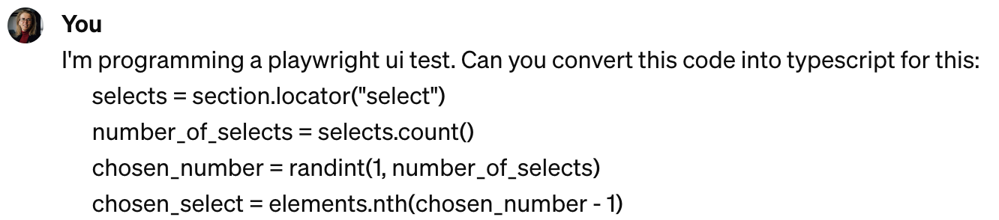
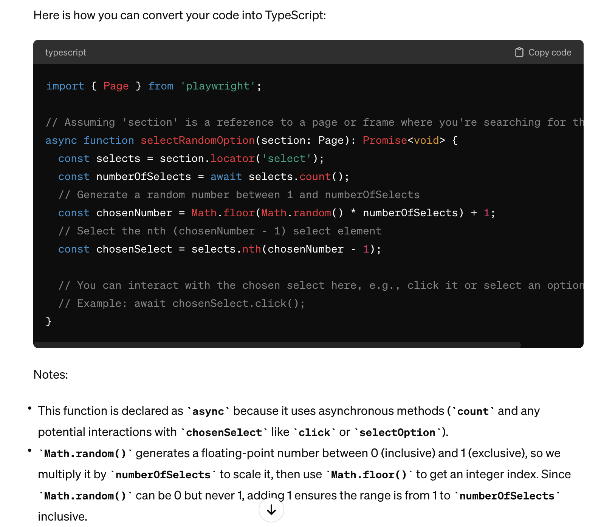
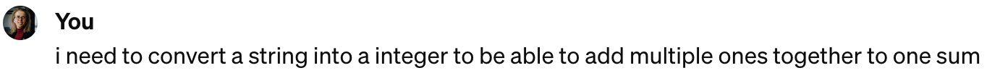
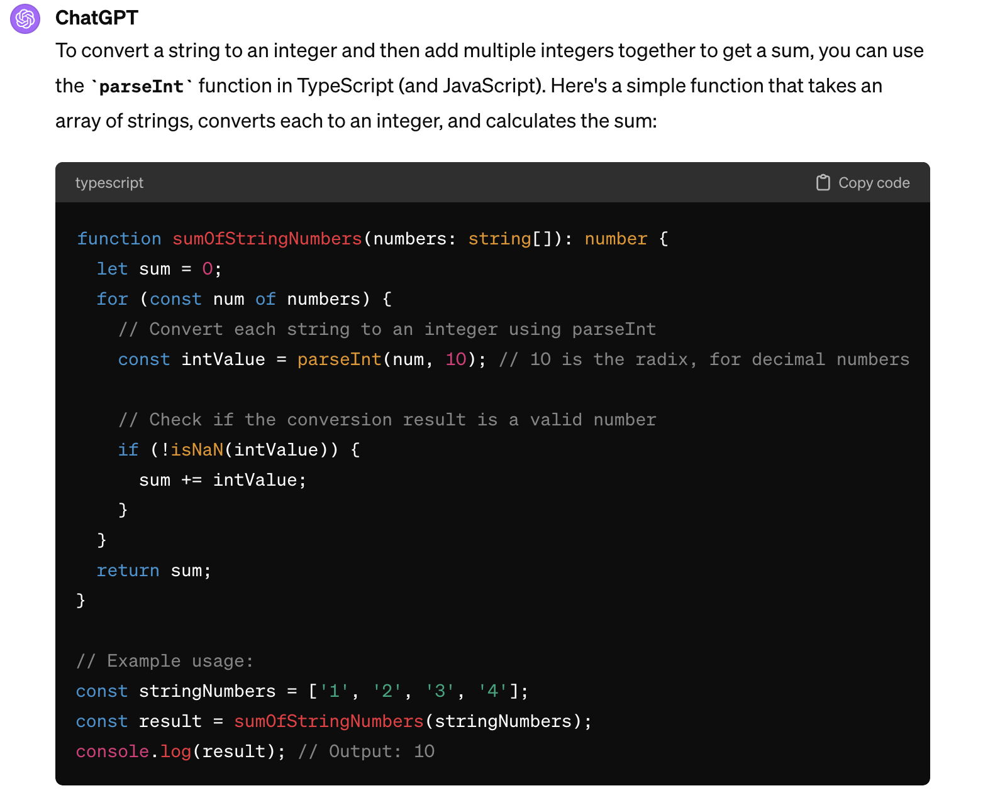
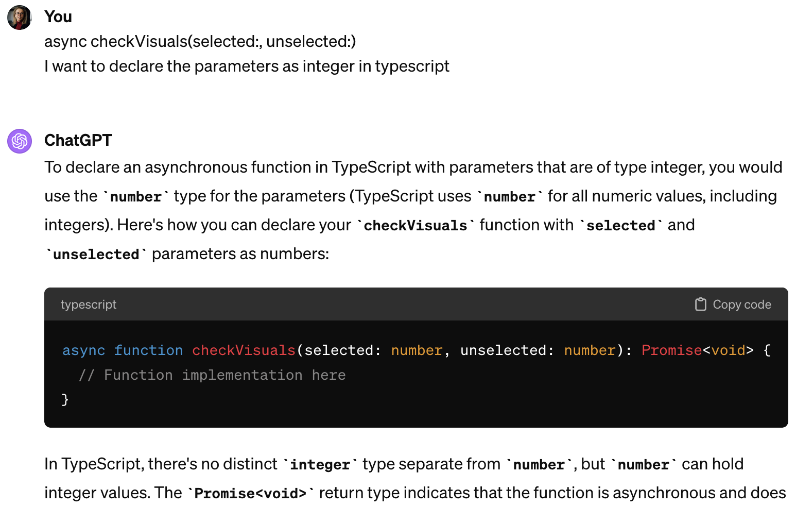
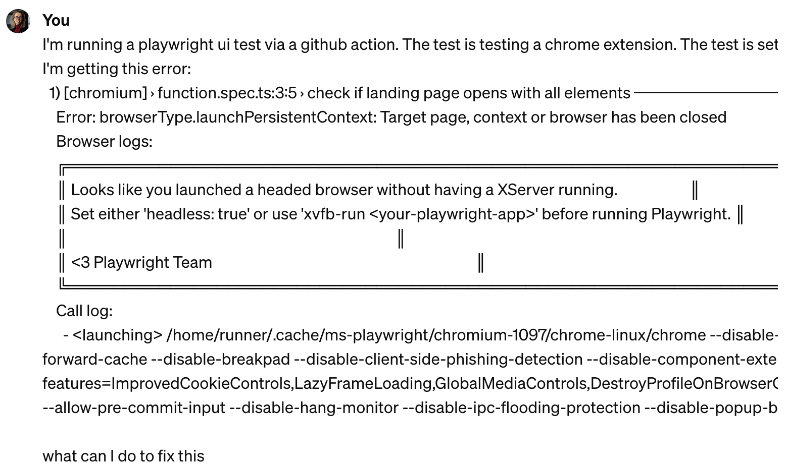
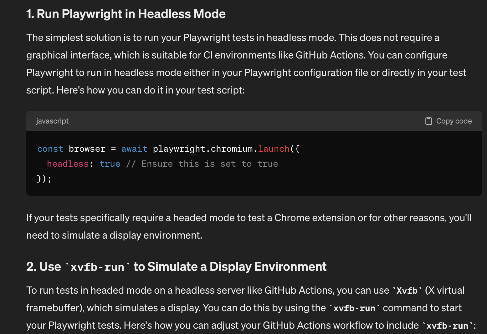

+++
date = 2024-02-27
title = "提升自动化测试：当 Playwright 遇上 ChatGPT"
description = "使用chatgpt快速学会playwright的实践"
authors = ["乙醇"]
[taxonomies]
tags = ["playwright进阶", "翻译"]
[extra]
math = false
image = "banner.jpg"
+++

由 [Christine Pinto](https://www.linkedin.com/in/christine-pinto/)撰写

在快速发展的软件开发领域,[Playwright](https://playwright.dev/) 凭借其与 Visual Studio Code 和 GitHub 的强大集成以及不断壮大的社区支持,重塑了自动化测试。我转向使用这个框架的过程因为结合了 ChatGPT 而得到显著的效率提升,标志着我今后编写和调试 UI 测试方式的一个转折点。

我采用 Playwright 和 ChatGPT 的旅程清楚地展示了 AI 在连接不同测试环境和编码语言之间的强大作用。这种组合不仅简化了迁移过程;它还丰富了工程师的工具箱,实现了更流畅和适应性更强的自动化测试方法。自动化工程师的经验和知识仍然至关重要,但 ChatGPT 作为一个强大的盟友,指导我们学习新技术和能力。

通过本文,我们将探讨 ChatGPT 如何促进这些转变,突出其中的优势和挑战。这证明了人类专业知识和人工智能如何在软件测试领域不断发展及协作。

自从 2020 年微软推出 Playwright 以来， 改工具因其对 Google Chrome、Firefox、Microsoft Edge 和 WebKit 等多种浏览器的全面支持而备受赞誉。Playwright 以其无缝集成多种编程语言中，其确保跨浏览器一致性结果的能力非常突出,现在已经成为了现代软件开发工作流程中的主要工具。其快速采纳技术社区的积极反馈得到了广泛的赞誉，这点通过不断增长的用户基础和 GitHub 星标数量可以得到完美的体现。Playwright 对提升自动化测试实践的贡献展示了其在该领域的重要性和创新性,使其成为有追求的测试工程师的首选工具。

## 在测试自动化中利用 ChatGPT

在本节中,我将向你展示 ChatGPT-4 如何显著简化我的编码实践。它帮助我找到错误消息的解决方案,将代码片段从一种编程语言转换为另一种,甚至仅根据几个输入和预定义的输出就能提出函数原型。我收集了一些我与 ChatGPT-4 实际对话中最喜欢的例子,向你展示它如何在现实情况下工作。如果你想看这些对话并了解更多关于 ChatGPT-4 如何帮助你编写自己的测试,请继续阅读!

## 将想法和代码片段转换为 TypeScript

由于主要使用 TypeScript 以外的语言,我使用 ChatGPT 帮助我将一些现有的编码项目和想法转换为 typescript。事实证明，它非常有用,指导我转换代码片段并在 TypeScript 中实现了各种概念 。这个 AI 工具平滑了我的学习曲线,使学习和使用 TypeScript 变得更加的高效可控。

_我的第一个提示:_

_这是 ChatGPT 的结果:_

这是一个很好的开始,特别是因为 ChatGPT 包含了 UI 测试所需的 Playwright 库的各种导入。

_接下来,我寻求一些帮助来完成我想执行的任务:_

_结果非常详细:_

_学习新的编程语言通常意味着要适应不同的数据类型,这可能很棘手。幸运的是,ChatGPT 也能在这方面提供帮助,使学习过程更加的顺畅:_

这是三个快速示例,展示了如何借助 ChatGPT 将思路或代码片段转换为 TypeScript。要深入了解对话和逐步过程,请查看此处的完整对话:[https://chat.openai.com/share/9656950e-b8a8-477d-afbc-f555a11db748](https://chat.openai.com/share/9656950e-b8a8-477d-afbc-f555a11db748)。

## 通过 ChatGPT 将 Playwright 与 GitHub Actions 集成

UI 测试启动并运行后,现在是时候通过 GitHub Actions 为我们的代码库建立自动化测试工作流了。这一步确保我们的测试无缝集成到开发周期中,提高 CI/CD 流水线的效率和可靠性。

基于这个目标,我写了以下提示:

> 如何使用 GitHub actions 在每次合并到主分支时执行 playwright UI 测试用例

ChatGPT 提供了一个简单的指南来设置 GitHub Action 工作流,使过程变得简单明了:

为了从 GitHub action 中访问 Playwright 报告,我写了以下提示:

> 如何保存在 GitHub action 期间创建的 playwright 报告,以便稍后可以访问它

ChatGPT 推荐使用 GitHub 的 artifact 上传功能来完成我的任务。然而,我遇到了一个问题,当 UI 测试报错时候,上传任务就不会执行,这促使我问以下问题:

> 我想让 GitHub action 在出错时也上传 artifact

_ChatGPT 的建议很有帮助,但它导致了一个假阳性问题,那就是即使 UI 测试代码出错而失败,GitHub Action 也显示成功。这需要我进一步完善提示:_

> 如果只想在失败时导出 playwright 报告,如何将其添加到 GitHub action 中

总结一下,很明显为 UI 测试设置精简的工作流对任何项目都是一个游戏规则的改变者。它不仅确保测试成为开发周期的一个连贯部分,还提高了 CI/CD 流水线的整体效率和可靠性。在整个过程中,与 ChatGPT 的互动在完善设计方案上面被证明非常有价值,突出了清晰沟通和迭代反馈对达成有效解决方案的必要性。这种经历强调了明确测试意图的价值,以及让我们看到了与 ChatGPT 合作解决问题的可能,引导我们实现量身定制的方案，最终达到集成的效果。

要深入了解对话和 ChatGPT 提供的分步指导,请查看此 URL 的聊天:[https://chat.openai.com/share/2998ae7d-3d76-49a4-87ae-f16793c0171e](https://chat.openai.com/share/2998ae7d-3d76-49a4-87ae-f16793c0171e)。

## 使用 ChatGPT 进行错误处理

我们都经历过这种情况——面对一条错误消息,我们陷入无休止的 Google 搜索、浏览论坛和阅读文章以寻找解决方案的漫长过程。这可能是绝对的浪费时间。幸运的是,ChatGPT 提供了一种更快的方法来应对这些情况。以下是 ChatGPT 如何帮助我解决在设置 GitHub action 工作流时遇到的错误(我继续之前的聊天),证明在高效故障排除方面，使用 ai 的优势十分明显。

_这是我的错误消息:_

_ChatGPT 提供了两种解决方案:在无界面模式下运行浏览器和使用 xvfb-run 模拟显示环境。考虑到我的测试涉及 Chrome 扩展,需要在有界面模式下运行,我决定探索 xvfb-run 方法。通常,当我遇到错误消息时,我会深入搜索许多论坛和文章以找到解决方法。这次,ChatGPT 直接切入主题,快速给我两个可靠的选择。我选择了第二个想法,尝试 xvfb-run,并且它成功了!这为我节省了大量时间和精力来弄清楚问题。_

## 探索 ChatGPT 集成的协同效应和挑战

将 ChatGPT 与 Playwright 集成带来了丰富的实际应用成果，展示了当前 AI 工具在测试自动化中的潜力和局限性。利用 AI 进行错误处理和将概念性想法转化为可执行的 TypeScript 代码等任务的转变，简化了编程过程的许多方面。这种方法不仅提高了效率，还促进了更动态和响应迅速的开发周期，使迭代更快、质量更高。

尽管取得了这些进展和好处，我在这个过程中也遇到了不少挑战。最大的挑战之一是我最初对完全由 AI 生成的解决方案的依赖。这些解决方案虽然创新，但需要仔细审查以验证其相关性和适用性。这一经历表明，人工监督在解释和完善 AI 生成的输出，以适应各种不同项目的独特需求方面仍然不可或缺。

从这种集成中，我学到了提示工程的重要性——这是一项在优化与 ChatGPT 交互方面至关重要的技能。有效的提示工程涉及制定能引导 AI 产生更准确和相关输出的查询，提高 ChatGPT 在编程任务中的实用性。学习这项技能不仅帮助我克服了与 AI 局限性相关的一些挑战，还极大地提高了利用 ChatGPT 进行测试自动化的效率。

此外，在利用 AI 能力和依赖自动化工程师的批判性思维和经验之间保持平衡的需求变得异常清晰。虽然 AI 可以自动化某些任务，但它无法模仿自动化工程师的细微理解和适应性问题解决技能。因此，利用 AI 导航测试自动化的复杂性需要一个持续的学习过程，其中理解提示工程的复杂性成为充分利用 ChatGPT 等 AI 工具的关键能力。

## AI 在测试自动化中的未来方向

展望 AI 在测试自动化中的未来，认识到 Auto Playwright 和 [ZeroStep](https://zerostep.com/) 等框架的潜力至关重要。这些工具旨在简化测试过程，为没有专门自动化工程师的团队提供了有趣的可能性。然而，重要的是理解，这些框架尽管创新，不能取代自动化工程师的宝贵技能。正如前面提到的，AI 在其当前状态下无法复制人类专家的知识深度、批判性思维和经验。在简要了解这些框架后，我仍然对它们与熟练专业人士相比的表现持怀疑态度，尽管我还没有亲自验证它们。

保持对 AI 进展的了解非常重要，因为在未来，平衡自动化技术和人类专业知识之间的关系将变得更加关键。我毫不怀疑，AI 将继续在识别稳定选择器等任务中发挥越来越多的支持作用，这是测试自动化中的一个常见挑战。任何处理过查找可靠选择器的人都知道这种困境，而 AI 快速识别不稳定选择器并提供有效修复的能力可能会大大改善我们工作的这一方面。这不仅会使过程更快更容易，还会增强自动化工程师向开发人员提供的反馈，从而提高整体软件质量。

## 结论

希望通过本文，你能了解 ChatGPT 如何显著加速了我向新测试框架和编程语言的过渡。它在错误处理和简化复杂任务方面的帮助是非常大的，使我进入新领域的旅程变得更快更易管理。使用 ChatGPT 所获得的见解和效率让我相信，在未来的项目中继续使用这个 AI 助手，特别是在错误处理和其他编程挑战方面。

我强烈建议同行的自动化工程师和开发人员亲自测试，探索 AI 助手如 ChatGPT 在测试自动化工作流程中的所有潜力。这些工具在增强成果、减少手动工作和为开发周期注入速度方面的价值不可低估。无论是简化技术之间的过渡、改进错误处理还是生成代码片段，将 AI 集成到测试自动化中的影响只会不断增长。

最后，我很乐意听到你在测试自动化中使用 AI 的经验！你是否发现了类似的好处，或者有自己独特的挑战？AI 助手如何改变了你自己的测试方法？让我们就在测试自动化中使用这些创新实践展开讨论。通过交流我们的故事和策略，我们可以集体推动我们领域的可能性，朝着技术和人类专业知识结合以实现软件质量显著提升和突破的未来迈进。

## 来源

[URL 来源](https://adventuresinqa.com/2024/02/27/elevating-automated-testing-playwright-meets-chatgpt/)

发布时间: 2024-02-27
