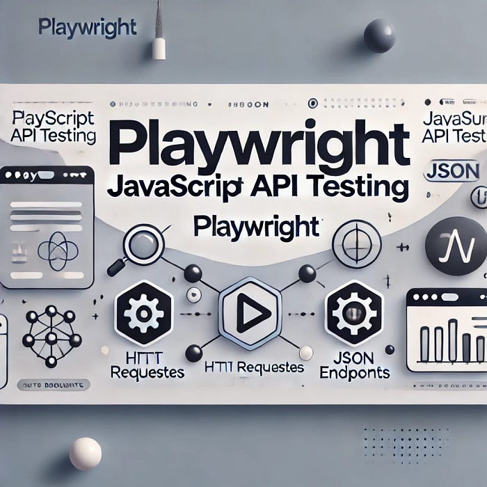
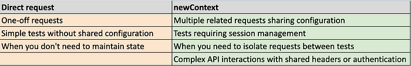
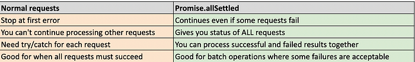

+++
date = 2025-01-18
title = "使用 Playwright JavaScript 进行 API 测试 "
description = " playwright也可以进行api测试"
authors = ["乙醇"]
[taxonomies]
tags = ["playwright进阶", "翻译"]
[extra]
math = false
image = "banner.jpg"
+++

首先，让我们从 API 测试的基础知识开始。我们将探讨 API 测试中使用的基本方法，然后深入探讨设计有效 API 测试用例的最佳实践。



## 使用 HTTP 方法进行 API 测试

1.  **GET**: 用于获取数据。  
    示例：获取 ID 为 `'1'` 的书籍的价格、作者姓名和书籍类别。
2.  **POST**: 用于创建新资源。  
    示例：通过提供书籍名称和 ID 等详细信息来创建一本新书。
3.  **PUT**: 用于通过完全替换数据来更新现有资源的所有字段。  
    示例：更新 ID 为 `'1'` 的书籍的价格、作者姓名和书籍类别。
4.  **PATCH**: 用于更新现有资源的特定字段，而不替换整个数据。  
    示例：仅更新 ID 为 `'1'` 的书籍的价格。
5.  **DELETE**: 用于删除特定资源。  
    示例：删除 ID 为 `'1'` 的书籍的所有详细信息。

> 现在，激动人心的部分来了！！Playwright JavaScript 如何发起请求。

**项目设置：**  
假设您已经在本地环境中安装了 Node.js，您可以通过以下命令安装 Playwright。

```bash
npm init @playwright/test
```

**如何在 Playwright 中发起 API 请求：**

使用 `直接使用 HTTP 方法的请求`：

```javascript
const { test, expect } = require("@playwright/test");

// 使用不同 HTTP 方法的示例
test("不同的 HTTP 方法", async ({ request }) => {
  // GET 请求
  const getResponse = await request.get(url, {
    params: { id: 123 }, // 这些会成为查询参数
  });

  // POST 请求
  const postResponse = await request.post(url, {
    data: { name: "test" }, // 请求体
  });

  // PUT 请求
  const putResponse = await request.put(url, {
    data: { name: "updated" },
  });

  // PATCH 请求
  const patchResponse = await request.patch(url, {
    data: { status: "active" },
  });

  // DELETE 请求
  const deleteResponse = await request.delete(url);

  // HEAD 请求
  const headResponse = await request.head(url);
});
```

使用 `newContext`：

```javascript
// 创建一个具有共享设置的上下文
const apiContext = await request.newContext({
  baseURL: "https://api.example.com",
  extraHTTPHeaders: {
    Authorization: "Bearer token123",
    Accept: "application/json",
  },
});

// 使用该上下文进行多个请求
const usersResponse = await apiContext.get("/users");
const postsResponse = await apiContext.get("/posts");
```

**使用 `newContext` 的主要好处：**

1.  **可重用的配置：**

```javascript
// 一次性设置，随处使用
const apiContext = await request.newContext({
  baseURL: "https://api.example.com",
  extraHTTPHeaders: {
    Authorization: "Bearer token123",
    Accept: "application/json",
  },
  timeout: 30000,
});

// 所有这些请求都使用相同的配置
await apiContext.get("/users");
await apiContext.post("/orders");
await apiContext.put("/profile");
```

2.  **灵活性**：当您在同一测试中需要不同的配置时

```javascript
test("测试多个 API", async ({ playwright }) => {
  // 用于 API 版本 1 的上下文
  const v1Context = await playwright.request.newContext({
    baseURL: "https://api.v1.example.com",
    extraHTTPHeaders: { "API-Version": "1.0" },
  });

  // 用于 API 版本 2 的上下文
  const v2Context = await playwright.request.newContext({
    baseURL: "https://api.v2.example.com",
    extraHTTPHeaders: { "API-Version": "2.0" },
  });

  // 在同一测试中使用两个上下文
  const v1Response = await v1Context.get("/data");
  const v2Response = await v2Context.get("/data");

  // 清理
  await v1Context.dispose();
  await v2Context.dispose();
});
```

3.  **会话管理：**

```javascript
test("详细的会话处理示例", async ({ request }) => {
  const apiContext = await request.newContext();

  // 1. 初始尝试访问受保护的路由（应该失败）
  const initialResponse = await apiContext.get("/protected-data");
  expect(initialResponse.status()).toBe(401); // 未授权

  // 2. 发起登录请求
  const loginResponse = await apiContext.post("/login", {
    data: {
      username: "testuser",
      password: "testpass",
    },
  });

  // 3. 服务器通常会返回类似的内容：
  // Set-Cookie: sessionId=abc123; Path=/; HttpOnly
  // apiContext 会自动捕获这些内容

  // 如果需要，您可以检查 cookies
  console.log("响应头:", loginResponse.headers());

  // 4. 下一个请求会自动包含 cookie
  const protectedResponse = await apiContext.get("/protected-data");
  expect(protectedResponse.ok()).toBeTruthy(); // 现在它可以工作了！

  // 5. 您可以发起多个请求，所有请求共享同一个会话
  const profileResponse = await apiContext.get("/profile");
  const ordersResponse = await apiContext.get("/orders");
  const settingsResponse = await apiContext.get("/settings");

  // 所有这些请求都自动包含了会话 cookie
});
```

何时使用直接请求和 `newContext`：



> 然而，如果您不需要在测试用例之间共享会话，并且更倾向于为每个测试使用全新的会话，我建议使用 `test.use()` 进行全局设置的直接请求 API，例如配置 API 头信息。`test.use()` 方法会自动处理清理工作，默认情况下确保测试隔离，并通过一致的配置使测试更易于维护。然而，当使用 `request.newContext` 时，它会跨测试维护会话状态（例如 cookies 和 localStorage），直到您显式调用 `dispose()` 函数。

**使用 `test.use()` 的示例代码：**

```javascript
test.describe("使用 test.use 进行测试", () => {
  test.use({
    extraHTTPHeaders: {
      Authorization: "Bearer token",
    },
  });

  test("第一次登录", async ({ request }) => {
    const loginResponse = await request.post("/api/login", {
      data: { username: "user1", password: "pass1" },
    });
    // 这会创建一个 cookie 会话

    const profileResponse = await request.get("/api/profile");
    // 此请求使用登录后的 cookie
  });

  test("第二次登录", async ({ request }) => {
    // 此测试完全重新开始！
    // 前一个测试的 cookies 不会被携带过来
    const profileResponse = await request.get("/api/profile");
    // 这会失败，因为我们没有会话
  });
});
```

**使用 `newContext` 的示例代码：**

```javascript
test.describe("使用 request.newContext 进行测试", () => {
  let context;

  test.beforeAll(async ({ request }) => {
    context = await request.newContext({
      extraHTTPHeaders: {
        Authorization: "Bearer token",
      },
    });
  });

  test("第一次登录", async () => {
    const loginResponse = await context.post("/api/login", {
      data: { username: "user1", password: "pass1" },
    });
    // 这会创建一个 cookie 会话

    const profileResponse = await context.get("/api/profile");
    // 此请求使用登录后的 cookie
  });

  test("第二次登录", async () => {
    // 此测试将能够访问前一个测试的 cookies！
    const profileResponse = await context.get("/api/profile");
    // 这会成功，因为会话仍然有效
  });

  test.afterAll(async () => {
    await context.dispose(); // 清理资源
  });
});
```

**让我们看看 Playwright 请求选项的完整结构：**

```javascript
test("演示所有请求选项", async ({ request }) => {
  const response = await request.post("https://api.example.com/endpoint", {
    // 1. 头信息
    headers: {
      "Content-Type": "application/json",
      Authorization: "Bearer token123",
      "Custom-Header": "value",
    },

    // 2. 请求体 - 可以作为 'data' 发送
    data: {
      name: "Test User",
      email: "test@example.com",
    },

    // 3. 查询参数
    params: {
      page: 1,
      limit: 10,
    },

    // 4. 超时设置
    timeout: 30000, // 30 秒

    // 5. 表单数据 (multipart/form-data)
    multipart: {
      file: {
        name: "test.txt",
        mimeType: "text/plain",
        buffer: Buffer.from("content"),
      },
      field: "value",
    },

    // 6. 忽略 HTTPS 错误
    ignoreHTTPSErrors: true,

    // 7. 最大重定向次数
    maxRedirects: 5,

    // 8. 在非 200 状态码时失败
    failOnStatusCode: true,

    // 9. 重试失败的请求
    maxRetries: 3,
  });
});
```

**关于 Playwright 请求 API 的关键知识点：**

常见选项：

- `data`: 请求体（自动为 JSON 字符串化）
- `headers`: 请求头
- `params`: 查询参数
- `timeout`: 请求超时时间（毫秒）
- `failOnStatusCode`: 是否在非 200 响应时抛出错误
- `ignoreHTTPSErrors`: 是否忽略 HTTPS 错误
- `form`: 用于表单提交
- `multipart`: 用于文件上传

此外，如果您想对与重定向端点相关的 API 进行安全测试，可以使用 `followRedirects: false` 选项。

```javascript
test("未认证访问时应重定向到登录页面", async () => {
  // 创建一个没有任何默认头信息的新上下文
  const cleanContext = await request.newContext();

  try {
    // 仅使用重定向头信息发起请求，并确保这是一个全新的请求
    const response = await cleanContext.get(`${BASE_URL}/admin/inventory`, {
      headers: {
        Accept: "application/json",
        "X-Handle-Redirect": "true",
      },
      followRedirects: false,
      maxRedirects: 0,
    });

    const responseHeaders = await response.headers();
    const responseStatus = response.status();

    // 验证重定向
    expect(responseStatus).toBe(302);
    expect(responseHeaders["location"]).toBe("/auth/login");

    // 手动跟随重定向
    if (responseHeaders["location"]) {
      const loginResponse = await cleanContext.get(
        `${BASE_URL}${responseHeaders["location"]}`,
        {
          headers: { Accept: "application/json" },
        }
      );

      expect(loginResponse.status()).toBe(200);
      const loginData = await loginResponse.json();
      expect(loginData.message).toBe("请登录以继续");
      expect(loginData.redirected).toBe(true);
    }
  } finally {
    await cleanContext.dispose();
  }
});
```

如果没有 `followRedirects: false`，如果服务器返回 302 重定向，Playwright 会自动跟随重定向到 `/auth/login`，并且 `response` 将来自登录页面（状态码 200）。我们将无法验证是否发生了重定向。

**API 响应中的常见检查：**

```javascript
// 使用此上下文发起请求
const response = await apiContext.get("/users");

// 重要的响应检查：

// 1. 状态码检查
expect(response.status()).toBe(200);

// 2. Content-Type 头信息检查
const headers = response.headers();
expect(headers["content-type"]).toContain("application/json");
expect(headers["cache-control"]).toBeDefined();

// 3. 响应结构检查
const data = await response.json();
expect(data).toHaveProperty("users");

// 模式验证
expect(body).toMatchObject({
  id: expect.any(Number),
  name: expect.any(String),
  createdAt: expect.any(String),
});

// 4. 响应时间检查（性能）
const timing = await response.timing();
expect(timing.responseEnd).toBeLessThan(2000); // 2 秒

// 5. 错误处理
const errorResponse = await request.get("https://api.example.com/non-existent");
if (!errorResponse.ok()) {
  const errorBody = await errorResponse.json();
  expect(errorBody).toHaveProperty("error");
  expect(errorBody.error).toHaveProperty("message");
}
```

要在 Playwright 中发起 API 请求，重要的是要理解 JavaScript 概念，如 `async/await`、`Promise.all()`、`Promise.race()`、`Promise.allSettled()` 和 Promise 链式调用。以下是每种类型在 API 请求中的使用示例：

1.  `Promise.all()` - 当您需要并行发起多个请求并且所有请求都必须成功时使用：

```javascript
test("Promise.all 示例", async ({ request }) => {
  // 当您需要所有请求都成功时使用
  try {
    const [usersResponse, postsResponse, commentsResponse] = await Promise.all([
      request.get("https://api.example.com/users"),
      request.get("https://api.example.com/posts"),
      request.get("https://api.example.com/comments"),
    ]);

    // 如果任何一个请求失败，整个 Promise.all 都会失败
    const users = await usersResponse.json();
    const posts = await postsResponse.json();
    const comments = await commentsResponse.json();

    // 现在您可以处理所有数据
    expect(users.length).toBeGreaterThan(0);
    expect(posts.length).toBeGreaterThan(0);
    expect(comments.length).toBeGreaterThan(0);
  } catch (error) {
    console.error("其中一个请求失败:", error);
  }
});
```

2.  `Promise.race()` - 当您想要获取最先完成的请求的结果时使用：

```javascript
test("Promise.race 示例", async ({ request }) => {
  // 用于测试故障转移场景或实现超时
  const timeoutPromise = new Promise((_, reject) =>
    setTimeout(() => reject(new Error("请求超时")), 5000)
  );

  try {
    // 在实际请求和超时之间进行竞争
    const response = await Promise.race([
      request.get("https://api.example.com/data"),
      timeoutPromise,
    ]);

    const data = await response.json();
    expect(data).toBeDefined();
  } catch (error) {
    console.error("请求超时或失败:", error);
  }
});
```

3.  `Promise.allSettled()` - 当您想知道所有请求的结果，无论成功还是失败时使用：

当您发起普通请求时，如果任何请求失败，它会立即抛出错误。

```javascript
test("普通请求 vs Promise.allSettled", async ({ request }) => {
  // 普通请求方法
  try {
    // 如果其中任何一个失败，代码将在该点停止执行
    const response1 = await request.post("https://api.example.com/orders", {
      data: { id: "001", item: "有效项目" },
    });

    const response2 = await request.post("https://api.example.com/orders", {
      data: { id: "002", item: "" }, // 无效 - 项目为空
    });

    const response3 = await request.post("https://api.example.com/orders", {
      data: { id: "003", item: "另一个有效项目" },
    });

    // 如果 response2 失败，此代码不会运行
    console.log("所有订单已创建");
  } catch (error) {
    console.log("发生错误，停止所有操作");
  }

  // Promise.allSettled 方法
  const orderRequests = [
    { id: "001", item: "有效项目" },
    { id: "002", item: "" }, // 无效 - 项目为空
    { id: "003", item: "另一个有效项目" },
  ];

  const results = await Promise.allSettled(
    orderRequests.map((order) =>
      request.post("https://api.example.com/orders", {
        data: order,
      })
    )
  );

  // 无论是否有失败，此代码都会运行
  // 您可以看到哪些订单成功，哪些失败
  const summary = {
    successful: [],
    failed: [],
  };

  for (let i = 0; i < results.length; i++) {
    const result = results[i];
    const order = orderRequests[i];

    if (result.status === "fulfilled" && result.value.ok()) {
      summary.successful.push({
        id: order.id,
        response: await result.value.json(),
      });
    } else {
      summary.failed.push({
        id: order.id,
        error:
          result.status === "rejected"
            ? result.reason
            : await result.value.json(),
      });
    }
  }

  console.log("总结:", summary);
  // 这可能会显示：
  // 总结: {
  //   successful: [
  //     { id: '001', response: {...} },
  //     { id: '003', response: {...} }
  //   ],
  //   failed: [
  //     { id: '002', error: '项目不能为空' }
  //   ]
  // }

  // 您仍然可以处理成功的订单
  expect(summary.successful.length).toBe(2);
  expect(summary.failed.length).toBe(1);
});
```

关键区别：



4.  **Promise 链式调用** - 当操作需要按顺序进行并且依赖于先前的结果时使用：

```javascript
test("Promise 链式调用示例", async ({ request }) => {
  // 第一种方法 - 使用 .then()
  request
    .post("https://api.example.com/users", {
      data: { name: "John" },
    })
    .then((response) => response.json())
    .then((user) =>
      request.post(`https://api.example.com/users/${user.id}/orders`, {
        data: { product: "item1" },
      })
    )
    .then((response) => response.json())
    .then((order) => {
      expect(order.status).toBe("created");
    })
    .catch((error) => console.error("错误:", error));

  // 第二种方法 - 使用 async/await（更易读）
  try {
    const userResponse = await request.post("https://api.example.com/users", {
      data: { name: "John" },
    });
    const user = await userResponse.json();

    const orderResponse = await request.post(
      `https://api.example.com/users/${user.id}/orders`,
      {
        data: { product: "item1" },
      }
    );
    const order = await orderResponse.json();

    expect(order.status).toBe("created");
  } catch (error) {
    console.error("错误:", error);
  }
});
```

感谢阅读，希望您觉得这篇文章有帮助。

如果您想了解更多关于使用 Playwright 进行 API 测试的最佳实践，我建议您阅读这篇博客。

### [原文地址](https://wisdomgoody.medium.com/master-api-testing-with-playwright-javascript-27337dd44c4d)
