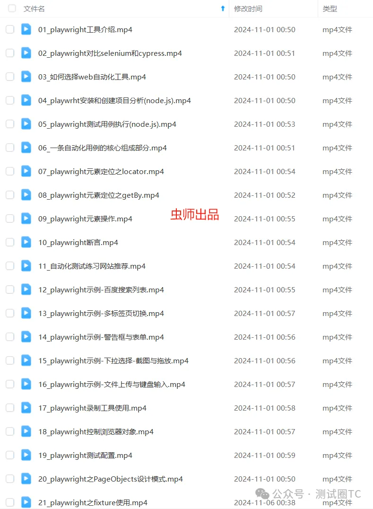

+++
date = 2024-11-08
title = "《playwright自动化测试精剪全套视频》-拿走不谢！"
description = "2024最新录制, 无废话紧凑版"
authors = ["虫师"]
[taxonomies]
tags = ["playwright基础", "video", "javascript"]
[extra]
math = false
image = "banner.jpg"
+++

## 2024 最新录制

今年 B 站直播的录制的，基于最新的 playwright 录制，内容非常丰富，除了官方 API 讲解，还提供大量的练习示例，还有 Playwright 的各种实用配置细节。

## 无废话紧凑版

我们平时在脱稿讲话的时候，会有重复，停顿，废话、错误排查、程序运行等待等。紧凑版就是把这些全部剪掉，只保留精华的部分。录制一个小时的视频，最终剪辑完可能不到 30 分钟。这套视频我剪了整整一周，手都快废了。

## 基于 node.js 版

首先，Python 版的我之前已经录制过了,B 站可以找到。

其次，node.js 版的 Playwright 的才能真正体现出 Playwright 的真正实力。其他版本都是残血版，即便如此，也能打 selenium。然而，Node.js 版更是提升一个维度。

最后，我可以负责任的说，如果你会 Python，那么这套 Node.js 版对你来说基本无门槛。作为一个多年 Pythonista ，如果要使用 Playwright，在没有特殊的要求，那么我优先会选 Node.js 版，因为确实太高效了。

## 获得完整视频

B 站地址：[https://www.bilibili.com/video/BV1hNDMYgEU6](https://www.bilibili.com/video/BV1hNDMYgEU6)

最后，完整视频总共 25 节，视频还有 10 节内容没有上传 B 站，想要的加 wx: zhiheng20170501。

