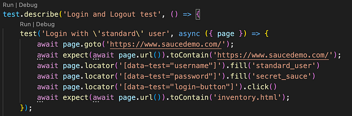
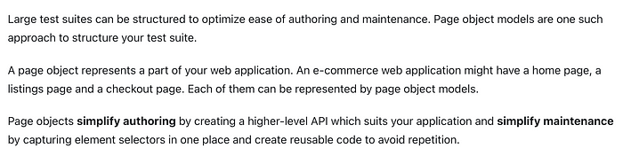
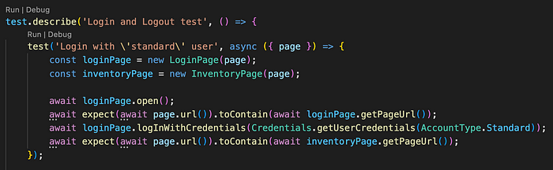
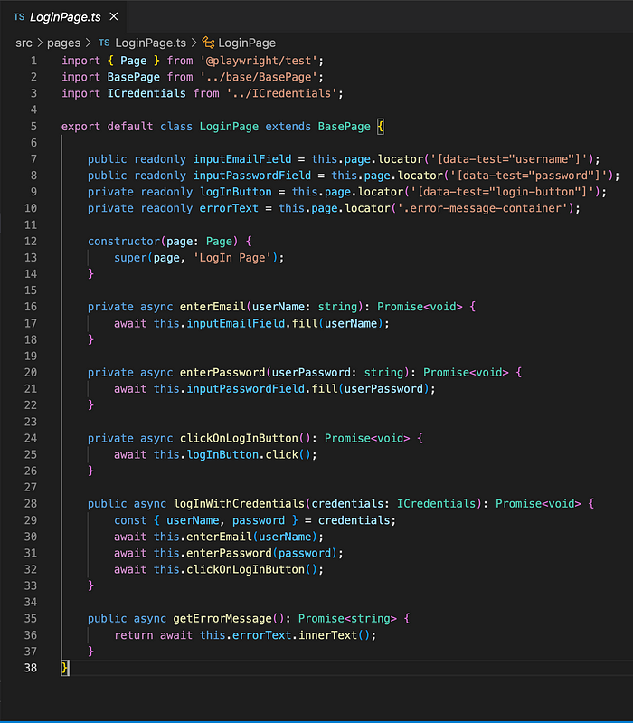
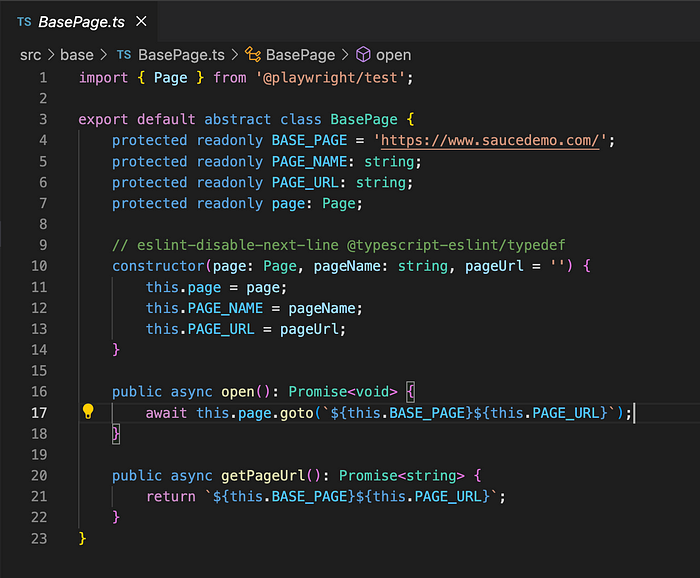
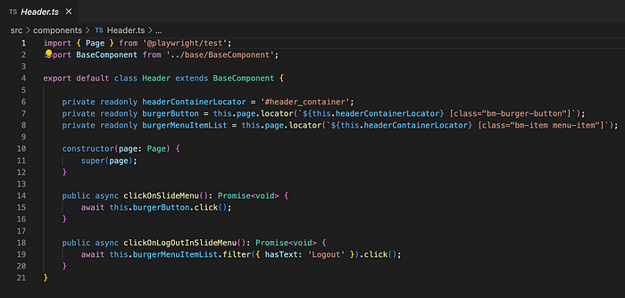
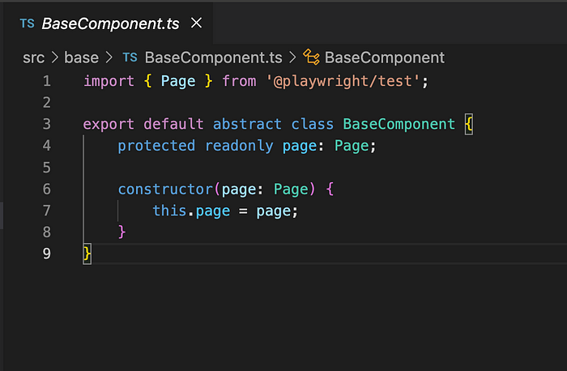
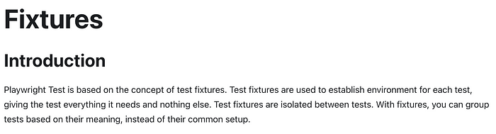

+++
date = 2024-01-22
title = "🎭Playwright: 如何正确使用 fixture 构建页面对象"
description = ""
authors = ["乙醇"]
[taxonomies]
tags = ["playwright进阶", "翻译"]
[extra]
math = false
image = "banner.jpg"
+++

本文适合测试自动化工程师或参与测试的开发人员阅读,特别是那些希望提升测试框架技能,使用页面对象模型来组织、维护测试并处理它们之间关系的人。对于已经在使用这种方法但想听听不同观点的工程师来说,本文也很有价值。

让我们来看一个简单的测试场景:



首先,我们需要打开主页('https://www.saucedemo.com/')。页面打开后,我们对其进行验证。然后,我们需要获取适当的选择器来填写用户名和密码字段,并点击"登录"按钮。
但是,如果我们想添加新的测试用例,使用另一种类型的用户(比如管理员用户)来进行登录的话，我们至少需要复制一次代码。
更糟糕的是,如果前端应用中的定位器发生变化,比如从**data-test="login-button"**变成**data-test="sign-in-button"**,我们就需要检查所有使用这个定位器的测试场景并进行修复。这种错误的修正非常耗时。

这个问题的解决方案就是使用页面对象模型。
简单解释如下:



网上有大量关于页面对象模型的文章、视频和教程。现在,我想分享我对如何正确构建页面的看法。

(如果你需要更多示例,请访问 > [https://github.com/VadimNastoyashchy/playwright-saucedemo.com](https://github.com/VadimNastoyashchy/playwright-saucedemo.com))



👆test.js



👆 登录页面



👆 页面抽象

对于组件,我倾向于使用相同的粒度:



👆header 组件



组件抽象 👆

现在看起来好多了。但是,我们仍然需要在每个测试块中使用{ page }fixture 来初始化我们的页面:

```javascript
test('Login with \\'standard\\' user with set cookies', async ({ page }) => {
  const loginPage = new LoginPage(page);
  const inventoryPage = new InventoryPage(page);
});
```

接下来,我将给出类和方法的例子。让我们仔细看看 Fixtures!



首先,我们需要创建一个文件。让我们命名为 FixtureConfig.ts
然后,我们需要定义页面的类型并覆盖项目的 fixture 配置:

```javascript
import { test as base } from "@playwright/test";
import LoginPage from "./pages/LoginPage";
import InventoryPage from "./pages/InventoryPage";
import ApiService from "./ApiService";
type MyFixtures = {
  loginPage: LoginPage,
  inventoryPage: InventoryPage,
  apiService: ApiService,
};

export const test =
  base.extend <
  MyFixtures >
  {
    loginPage: async ({ page }, use) => {
      const loginPage = new LoginPage(page);
      await use(loginPage);
    },
    inventoryPage: async ({ page }, use) => {
      const inventoryPage = new InventoryPage(page);
      await use(inventoryPage);
    },
    apiService: async ({ page }, use) => {
      const apiService = new ApiService(page);
      await use(apiService);
    },
  };
export { expect } from "@playwright/test";
```

最后,你需要在测试文件中更改导入语句
从:


改为:


现在,你可以在测试中使用 Fixture,通过包含所有在 FixtureConfig.ts 文件中定义的页面的 fixture 对象:

```javascript
test.describe('Login and Logout test', () => {
  test('Login with \\'standard\\' user', async ({ page, loginPage, inventoryPage }) => {
  await loginPage.open();
  await expect(await page.url()).toContain(await loginPage.getPageUrl());
  await loginPage.logInWithCredentials(Credentials.getUserCredentials(AccountType.Standard));
  await expect(await page.url()).toContain(await inventoryPage.getPageUrl());
});
```

文章中使用的资源:

[https://playwright.dev/docs/test-fixtures](https://playwright.dev/docs/test-fixtures)

[https://github.com/VadimNastoyashchy/playwright-saucedemo.com](https://github.com/VadimNastoyashchy/playwright-saucedemo.com)

## 来源

来源 URL: https://medium.com/@vadym_nastoiashhyi/playwright-how-to-build-page-object-correctly-using-fixtures-ff0a8c05b395

发布时间: 2024-01-22T07:01:37.131Z
