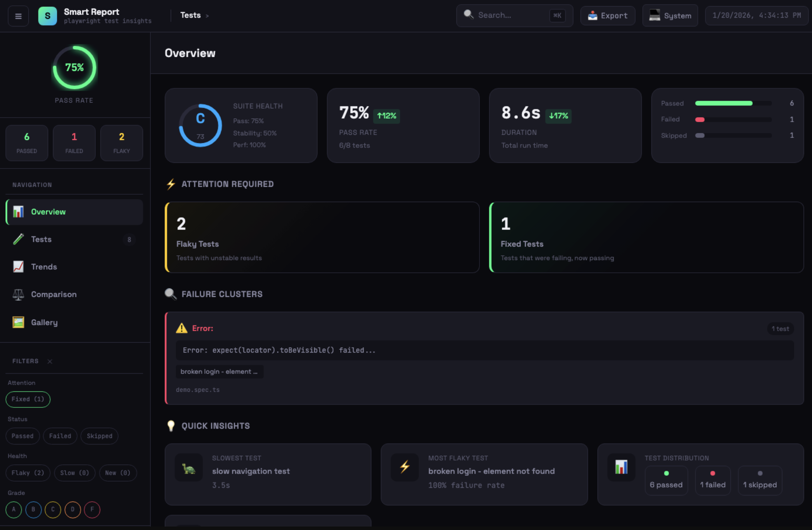

+++
date = 2026-02-14
title = " 使用 playwright-smart-reporter 打造智能、带AI分析的测试报告 "
description = "一个专为 Playwright 测试框架打造的智能 HTML 报告模版。"
authors = ["乙醇"]
[taxonomies]
tags = ["playwright基础", "原创", "测试报告", "AI"]
[extra]
math = false
image = "2026-02-14-19-33-57.png"
+++

playwright-smart-reporter 是一个专为 Playwright 测试框架打造的智能 HTML 报告工具。

它比 Playwright 自带的 HTML reporter 更现代化、更智能，主要目标是帮助团队更快定位问题、减少调试时间、提升测试稳定性。

仓库地址（持续更新）：  
[https://github.com/qa-gary-parker/playwright-smart-reporter](https://github.com/qa-gary-parker/playwright-smart-reporter)

项目支持python和javascript，我们先拿js版本来体验一下。

#### 第一步：安装

```bash
# Node.js 项目（最常用方式）
npm install -D playwright-smart-reporter

# 如果你使用 Python + pytest-playwright
pip install playwright-smart-reporter-python
# （Python 版文档请看仓库 python/README.md，本教程主要讲 JS/TS 版）
```

#### 第二步：最简配置（3分钟上手）

在 `playwright.config.ts` / `.js` 中添加 reporter：

```ts
import { defineConfig } from "@playwright/test";

export default defineConfig({
  // ... 其他配置 ...

  reporter: [
    [
      "playwright-smart-reporter",
      {
        outputFile: "playwright-report/smart-report.html", // 建议放在报告目录
        historyFile: "playwright-report/test-history.json", // 很重要！用于历史趋势、flaky检测
        maxHistoryRuns: 12, // 保留最近12次运行的历史
      },
    ],

    // 你可以同时保留官方的html reporter（可选）
    ["html", { outputFolder: "playwright-report", open: "never" }],
  ],

  // 强烈建议开启 trace（很多高级功能依赖它）
  use: {
    trace: "retain-on-failure", // 或 'on' 如果你想每个测试都保留
    // screenshot: 'only-on-failure',  // 配合使用效果更好
  },
});
```

运行测试：

```bash
npx playwright test
```

结束后打开生成的报告：

```bash
npx playwright show-report playwright-report/smart-report.html
# 或者直接浏览器打开文件
```

你应该能看到一个带有侧边栏、仪表盘、健康评分、失败聚类、趋势图的现代报告界面。

#### 第三步：推荐的实用配置（日常推荐）

```ts
reporter: [
  ['playwright-smart-reporter', {
    // 核心输出
    outputFile: 'playwright-report/smart-report.html',
    historyFile: 'playwright-report/history.json',
    maxHistoryRuns: 15,

    // AI 失败分析（强烈推荐）
    enableAIRecommendations: true,

    // 稳定性 & 性能相关
    enableStabilityScore: true,
    enableRetryAnalysis: true,
    performanceThreshold: 0.25,           // 比历史平均慢25%报警
    enableFailureClustering: true,

    // 界面与体验
    filterPwApiSteps: true,               // 隐藏大量 page.click() 等底层步骤，只看 test.step()
    enableTraceViewer: true,
    enableNetworkLogs: true,
    enableGalleryView: true,

    // CI 友好
    runId: process.env.GITHUB_RUN_ID || process.env.CI_PIPELINE_ID || 'local',
    projectName: 'e2e-ui',                // 多项目时建议区分

    // 通知（可选）
    // slackWebhook: process.env.SLACK_WEBHOOK_URL,

    // 阈值微调（可选，根据团队实际情况调整）
    thresholds: {
      flakinessStable:   0.08,
      flakinessUnstable: 0.25,
      performanceRegression: 0.20,
      stabilityWeightFlakiness: 0.40,
      stabilityWeightPerformance: 0.30,
      stabilityWeightReliability: 0.30,
    },
  }],
],
```

#### 第四步：开启 AI 失败分析（最有价值的功能之一）

设置以下任一环境变量（优先级：Claude > OpenAI > Gemini）

```bash
# 推荐 Claude（分析质量较好）
export ANTHROPIC_API_KEY=sk-ant-xxx...

# 或者 OpenAI
export OPENAI_API_KEY=sk-xxx...

# 或者 Google Gemini
export GEMINI_API_KEY=xxx...
```

重新跑测试 → 失败的case下方会出现 AI 给出的可能原因 + 修复建议（批量分析，适合大测试套件）。

#### 第五步：CI 集成（让历史数据持续积累）

**GitHub Actions 示例**（最常见场景）

```yaml
- name: Cache history file
  uses: actions/cache@v4
  with:
    path: playwright-report/history.json
    key: test-history-${{ github.ref }}
    restore-keys: test-history-

- name: Run Playwright tests
  run: npx playwright test --reporter=playwright-smart-reporter

- name: Save history cache (always)
  if: always()
  uses: actions/cache/save@v4
  with:
    path: playwright-report/history.json
    key: test-history-${{ github.ref }}-${{ github.run_id }}

- name: Upload smart report
  if: always()
  uses: actions/upload-artifact@v4
  with:
    name: smart-test-report
    path: playwright-report/smart-report.html
```

其他 CI（GitLab、CircleCI、Azure 等）也有类似缓存逻辑，详见官方文档 CI Integration 部分。

#### 第六步：常用高级技巧速查

| 目标                          | 配置项 / 命令                                             | 备注                     |
| ----------------------------- | --------------------------------------------------------- | ------------------------ |
| 隐藏底层 pw:api 步骤          | `filterPwApiSteps: true`                                  | 报告更干净               |
| 只看最近10次历史的趋势        | `maxHistoryRuns: 10`                                      | 默认10                   |
| 打开本地带 trace 的报告服务器 | `npx playwright-smart-reporter-serve smart-report.html`   | 解决 file:// 跨域问题    |
| 合并分片运行的历史            | `npx playwright-smart-reporter-merge-history ...`         | CI 分片后使用            |
| 严格 CSP 环境（公司内网常见） | `cspSafe: true`                                           | 用文件引用而非 base64    |
| 查看单个 trace 文件           | `npx playwright-smart-reporter-view-trace traces/xxx.zip` | 调试用                   |
| 性能回归报警阈值调低          | `performanceThreshold: 0.15`                              | 更敏感                   |
| 只关心 UI 项目历史            | `projectName: "ui-tests"`                                 | 避免 api/ui 混在一起统计 |

#### 常见问题快速定位

- **没有历史数据 / 趋势图为空** → 检查 `historyFile` 是否正确，CI 是否缓存成功
- **没有 AI 建议** → 检查是否设置了 API Key，且失败用例存在
- **报告文件超大、浏览器卡** → 试试 `cspSafe: true` 或减小 `maxHistoryRuns`
- **flaky 判断跟官方不一样** → 正常，Smart Reporter 是基于**多轮历史**而非单次重试
- **网络请求没显示** → 确认 `trace: 'retain-on-failure'` 或 `'on'` 已开启



#### 总结 — 建议的起步路径

1. 先用最简配置跑一次，感受现代仪表盘和健康评分
2. 加上 AI Key，体验自动失败分析
3. 把 `history.json` 纳入 CI 缓存 → 几天后趋势图和 flaky 检测开始生效
4. 根据团队痛点逐步打开 network logs、gallery、step timeline 等功能

Happy testing! 🚀
