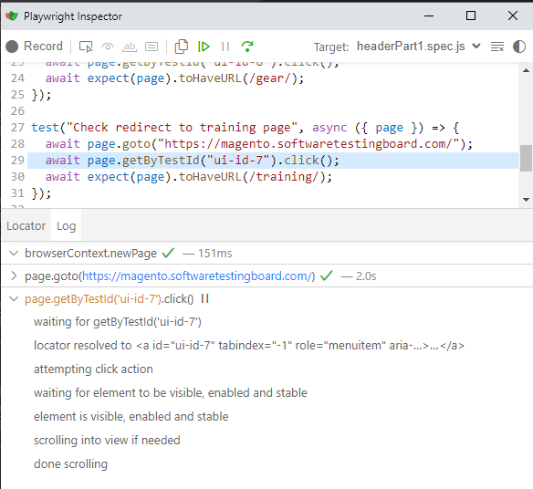

+++
date = 2024-10-20
title = "Playwright 使用技巧与诀窍  #4"
description = "合理断言以及验证表格"
authors = ["乙醇"]
[taxonomies]
tags = ["playwright进阶", "翻译"]
[extra]
math = false
image = "banner.jpg"
+++

继续我们的提示与技巧系列，在[#1](img/1730512646.597784)、[#2](img/1730512648.933496)和[#3](img/1730512644.012545)取得成功后，我们推出了最新的[#4](#)。希望你喜欢，并且别忘了阅读代码片段中的注释。

## 1. 如何拦截多个相同路由的请求？

我记得在 Cypress 中，这个功能非常容易实现，但在 Playwright 中，找到这种特定场景的细节却并不简单。想象一下，你在网页应用中导航，并希望验证多个具有相同路由的请求。比如，当你打开某个产品页面时，API 会在`api/id/1`发起请求以获取数据，然后你需要再次拦截同样的请求。如何拦截这两个请求？并且验证它们的数据？

你可以使用[waitForRequest()](https://playwright.dev/docs/api/class-page?ref=blog.martioli.com#page-wait-for-request)来尝试，但还有一种更灵活的方法，这将为你打开更多的可能性。

```javascript
import { test } from "@playwright/test";

test("验证多个相同路由的调用", async ({ page }) => {
  const requests: string[] = [];

  // 使用路由来区分你的网络调用
  await page.route("**/api/**", async (route) => {
    // 使用url().includes来过滤所需的确切调用
    if (route.request().url().includes("id/1")) {
      await route.continue();
      const response = await (await route.request().response())?.json();
      requests.push(response);
    } else {
      await route.continue();
    }
  });

  // 上面的代码像是一个你设置的监听器。将其放在触发网络调用之前

  await page.goto("www.yourapp.com");
  // 想象这一步触发了第一个id/1调用
  await product.click();
  // 这一步触发了第二个id/1调用
  await productExtraDetails.click();

  // 现在你等待它们并执行任何所需的断言
  await expect(async () => {
    expect(requests.length).toBe(2);
  }).toPass({
    intervals: [1_000, 2_000, 5_000],
    timeout: 15_000,
  });
});

// 下面是你需要的额外步骤
// 因为有时你的测试完成得比应用响应要快，你需要取消路由。
test.afterEach("取消所有路由", async ({ page }) => {
  await page.unrouteAll({ behavior: "wait" });
});
```

我见过这个场景的最常见用例是验证 trackers。

---

## 2. 在未断言元素数量之前不要使用.all()

假设你有一个选择器会返回多个元素，而你想遍历这些元素以断言某些值。如果你没有先断言数量，你的测试可能会出现假阳性。这就是原因。

如果你有 3 个元素，并执行以下代码：

```javascript
import { test } from "@playwright/test";

test("在.all()上假阳性", async ({ page }) => {
  const expectedValues = ["a", "b", "c"];
  // 其他操作

  const allElements = await page.getByTestId(locator).all();

  for (const item of allElements) {
    await expect(item).toHaveAttribute("any-attribute", expectedValues);
  }
});
```

测试将如预期工作。然而，如果由于某种原因你的选择器在页面上找不到任何元素，测试将**仍然通过**。因为`.all()`在数量为零时不会报错，如果没有元素，forEach 将不会运行。

要正确处理此情况，你必须在遍历元素之前断言元素的数量。记得使用自动重试的[toHaveCount](https://playwright.dev/docs/test-assertions?ref=blog.martioli.com#auto-retrying-assertions)，而不是像(allElements.length).toBe(3)这样的语句。

```javascript
import { test, expect } from "@playwright/test";

test("正确使用.all()", async ({ page }) => {
  const expectedValues = ["a", "b", "c"];
  // 其他操作

  await expect(page.getByTestId(locator)).toHaveCount(5);
  const allElements = await page.getByTestId(locator).all();

  for (const item of allElements) {
    await expect(item).toHaveAttribute("any-attribute", expectedValues);
  }
});
```

即使是[Playwright 官方文档](https://playwright.dev/docs/api/class-locator?ref=blog.martioli.com#locator-all)也警告你关于`.all()`的使用，但现在你知道在未断言数量的情况下，这将不会正常工作。

> 专业提示：在 Playwright 的 async/await 风格中，不建议使用 forEach。你需要使用 for...of 来避免问题。

---

## 3. 点击之前无需断言可见性

我觉得有必要提到这一点，因为我看到这种情况太频繁了。人们习惯在与元素交互之前断言其可见性，这是在任何教程或课堂上学到的行为，过去每个人都被迫学习的关键步骤。然而在 Playwright 中，有一种特定情况你不需要这样做。这种情况是对`click()`操作。以下是 Playwright 在点击元素之前所做的事情：



这些被称为[可操作性检查](https://playwright.dev/docs/actionability?ref=blog.martioli.com)，而且不仅限于`click()`。

> 一个关键点是，不要将其与 toHaveText 的断言混淆。当你使用最常见的断言方法之一[toHaveText](https://playwright.dev/docs/api/class-locatorassertions?ref=blog.martioli.com#locator-assertions-to-have-text)时要小心，因为 toHaveText 不会在元素可见之前等待。

---

## 4. 如何只运行我正在处理的测试？

对于大多数关注[Playwright 发布说明](https://playwright.dev/docs/release-notes?ref=blog.martioli.com)的你来说，这可能已经很熟悉，但有些人可能不知道，你可以使用一个特殊的 CLI 命令，只运行那些已更改的测试。

想象一下你执行了`git pull`，然后创建自己的分支开始处理某些测试，但你修复了多个测试中的一些错误或甚至创建了新的多个测试。那么你可以这样运行测试：

`npx playwright test path/to/test1.spec.ts path/to/test2.spec.ts path/to/test3.spec.ts path/to/test4.spec.ts path/to/test5.spec.ts path/to/test6.spec.ts path/to/test7.spec.ts`

你可以简化为：

`npx playwright test --only-changed=main`

这将比较你的分支与主分支，并运行所有在你的分支中被修改的测试。

---

## 5. 如何在 Playwright 中验证表格数据？

假设你有一个表格，需要验证渲染的值。我不是在这里验证某个单元格中是否存在某个文本，而是要验证一个确切的值是否在特定的单元格中，该单元格对应确切的列和行。

你可以通过创建一个辅助函数来实现。为了方便你自己运行下面的代码并轻松测试，我将所有内容放在同一个文件中，当然，你可以根据自己的方式存储工具/辅助函数。

那么这个辅助方法是如何工作的呢？你给它三个参数，第一个是标题（列）的文本，第二个是你要验证的行，第三个是你希望在该单元格中看到的期望文本。

```javascript
import { test, expect } from "@playwright/test";

class WebTableHelper {
  constructor(page) {
    this.page = page;
  }

  async validateCellValueReferenceToHeader(
    headerText,
    rowToValidate,
    expectedValue
  ) {
    const elementsOfHeader = await this.page
      .getByRole("table")
      .getByRole("row")
      .first()
      .getByRole("cell")
      .all();

    const elementsOfNRow = await this.page
      .getByRole("table")
      .getByRole("row")
      .nth(rowToValidate)
      .getByRole("cell")
      .all();

    for (let i = 0; i < elementsOfHeader.length; i++) {
      const headerValueFound = await elementsOfHeader[i].innerText();
      if (headerValueFound.toLowerCase() === headerText.trim().toLowerCase()) {
        const cellValue = await elementsOfNRow[i].innerText();
        expect(cellValue).toBe(expectedValue);
        return;
      }
    }
    throw new Error(`未找到文本为 "${headerText}" 的标题`);
  }
}

test("测试表格", async ({ page }) => {
  await page.goto("https://cosmocode.io/automation-practice-webtable");
  const helper = new WebTableHelper(page);
  await expect(page.getByRole("table").getByRole("row")).toHaveCount(197);
  await helper.validateCellValueReferenceToHeader("

Name", 3, "Ben");
});
```

你也可以像这样扩展它以验证更多的行，但你现在知道这段代码是如何运行的。

---

希望你喜欢这个小技巧和提示系列。每当你遇到复杂的场景或需要执行的特定操作时，记得看看 Playwright 的文档，因为它总是提供你需要的信息。也许你会找到一些你不知道的非常实用的功能。

关注我们的下一篇文章，看看我们会分享哪些内容！

## 来源

[https://blog.martioli.com/playwright-tips-and-trick-4/](https://blog.martioli.com/playwright-tips-and-trick-4/)
