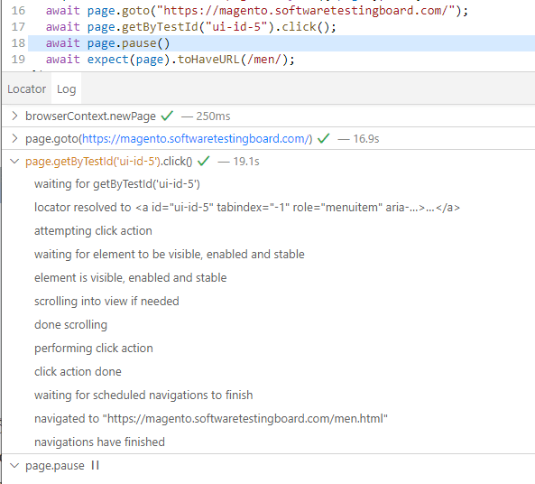

+++
date = 2024-01-08
title = "Playwright 使用技巧与诀窍 #2"
description = "等待,自定义断言，轮询以及调试"
authors = ["乙醇"]
[taxonomies]
tags = ["playwright进阶", "翻译"]
[extra]
math = false
image = "banner.jpg"
+++

我之前写了一篇[关于使用技巧和诀窍的文章](https://blog.martioli.com/playwright-tips-and-tricks-1/),获得了很多好评。因此,我决定再写一篇。

### 1. 如何在 Playwright 中处理页面完全加载后才出现的元素

有时候,即使 Playwright 等待页面完全加载,某些元素可能仍然在之后才出现在 DOM 中。这种情况下,我推荐以下几个技巧:

- 方法一,等待网络空闲: `page.goto('https://playwright.dev/', {waitUntil: 'networkidle'})`
- 方法二,等待元素达到特定状态。使用 [element.waitFor(state)](https://playwright.dev/docs/api/class-locator?ref=blog.martioli.com#locator-wait-for)。默认值是"visible",但你可以更改为等待元素出现在 DOM 中,比如先执行 `const element = page.locator('#locator')`,然后 `await element.waitFor("attached")`

### 2. 自定义 expect 消息

你知道吗?当断言失败时,你可以使用[自定义的 expect 消息](https://playwright.dev/docs/test-assertions?ref=blog.martioli.com#custom-expect-message): `await expect(locatorOrValue, '执行某操作失败').toBe()`。这在自定义方法或页面方法中特别有用,可以提供更详细的失败信息。

### 3. 如何在 Playwright 中断言收到了邮件

假设你有一个注册表单,提交后会发送一封带确认号/链接的邮件。由于邮件不会立即出现在收件箱,你可以使用 Playwright 的 [expect.poll](https://playwright.dev/docs/test-assertions?ref=blog.martioli.com#expectpoll) 进行[轮询](<https://en.wikipedia.org/wiki/Polling_/(computer_science/)?ref=blog.martioli.com>)。请看下面的注释,我会解释其工作原理。

```javascript
await expect
  .poll(
    async () => {
      const allEmails = await page.request.get(
        "https://api.email.com/allEmails"
      );
      // 在这里进行逻辑处理,例如搜索包含注册表单用户名/邮箱的邮件
      for (email of allEmails) {
        if (email.to.includes("registrationForm@email.com"))
          // 找到邮件后,编写逻辑从邮件内容中提取链接/代码
          return emailCode;
      }
      return false;
    },
    {
      // 这部分是轮询配置,都是可选的
      // 自定义错误消息,超时后触发
      message: "未能在邮件中找到确认链接",
      // 探测, 等待1秒, 探测, 等待2秒, 探测, 等待10秒, 探测, 等待10秒, 探测
      // ... 默认为 [100, 250, 500, 1000]
      intervals: [1_000, 2_000, 10_000],
      // intervals 中的最后一个值会重复直到超时。超时后会抛出带有自定义消息的错误
      timeout: 60_000,
    }
  )
  .toBeTruthy();
```

请记住,每次未找到邮件时,expect 都会像循环一样继续执行。只有在 60 秒后仍未返回预期的真值时,才会失败。你可以轻松将 `toBeTruthy()` 更改为任何 [jest expect](https://playwright.dev/docs/test-assertions?ref=blog.martioli.com#non-retrying-assertions) 类型的方法,以满足你的特定需求和返回逻辑。

### 4. 如何让断言失败但不导致测试失败?

首先,可以看看[软断言](https://playwright.dev/docs/test-assertions?ref=blog.martioli.com#soft-assertions),这可能是你想要的。

或者,你可能在期望某个随机时间间隔出现的东西。Playwright 有一个 expect 方法可以重复执行多个断言,直到全部通过,它叫做 [expect.toPass()](https://playwright.dev/docs/test-assertions?ref=blog.martioli.com#expecttopass)。只需将所有断言放在 expect.toPass() 内即可。这个方法的工作原理类似于上面解释的 expect.poll(),但这次我们可以在 expect 方法内执行一个或多个可能失败几次才成功的 expect()。条件是它们必须全部通过。因此,代码块会重复执行,直到满足条件(或超时)。这里有个例子:

```javascript
test("元素在 5 秒后出现", async ({ page }) => {
  await page.goto("https://webdriveruniversity.com/Accordion/index.html");
  await expect(async () => {
    await expect(page.getByText("LOADING")).toBeVisible();
    await expect(page.getByText("COMPLETE.")).toBeVisible();
  }).toPass({
    intervals: [1_000, 5_000, 10_000],
    timeout: 60_000,
  });
});
```

注意配置现在放在 toPass({}) 内

### 5. 如何在 Playwright 中拦截网络调用?

这里我们不讨论 [page.route()](https://playwright.dev/docs/api/class-page?ref=blog.martioli.com#page-route)

端到端测试有两种类型:[水平和垂直](https://smartbear.com/learn/automated-testing/how-to-perform-end-to-end-testing/?ref=blog.martioli.com#vertical-vs-horizontal-endtoend-testing)。最常见的是水平测试,例如测试购买产品的流程。这是一个用户流程。较少人知道的是垂直测试,它测试 `用户操作 -> 前端(UI) -> 后端 -> 数据库` 或 `数据库 -> 后端 -> 前端 -> 用户所见`。

举个例子,假设点击按钮生成发票,值显示在你账户的 UI 层。前端可能对从后端接收的数据进行计算后显示值。如果显示的值不正确,谁该负责?前端开发人员会说是后端问题,后端开发人员会说是前端问题。听起来熟悉吗?要找到这种 bug,你可以这样做:

- 对前端,对将在 UI 中显示的值进行断言
- 对后端,监听网络调用,在数据到达前端之前断言后端通过 API 发送的内容

这将在两个层面上进行验证。那么,我们如何在 Playwright 中拦截调用呢?使用 [waitForResponse](https://playwright.dev/docs/api/class-page?ref=blog.martioli.com#page-wait-for-response)。让我给你一段代码作为进一步说明:

```javascript
// 前面的双星号用于在多个环境中实现动态等待
// 注意 waitForResponse 前面没有 await。它只是标记从何时开始监听该调用
const invoiceCall = page.waitForResponse("**/invoices/*");
await page.getByText("Generate Invoice").click();

// 默认会等待该调用 30 秒
const response = await invoiceCall;

// 现在将响应转为 json 以便轻松读取
const responseAsJson = await response.json();
await expect(responseAsJson.invoice.value).toBe("355");
```

> 为什么要关心"从何时开始"这部分?这在你想拦截来自同一 api 接口 的多个调用时很有用。稍后会详细讨论。

### 6. 如何在 Playwright 中像专业人士一样调试?

这个主题其实值得单独写一篇博文,[我在这里写过](https://blog.martioli.com/debugging-tests-with-playwright/)。但我想指出一点,几乎每个人都忽略了 Playwright 自带的调试器,[叫做 inspector](https://playwright.dev/docs/debug?ref=blog.martioli.com#playwright-inspector),能提供比你想象的多得多的信息。让我告诉你我的意思。假设你有一行代码,你就是搞不明白为什么无法达到你想要的效果。你可以这样做,用 `npx playwright test path/to/yourTest.spec.js --debug` 启动测试,然后进入 inspector,打开你想了解更多的操作,你就会看到 Playwright 在后台执行的所有操作:



> 小提示:我不是很喜欢这个 inspector,因为在目前的 v1.40 版本中,它有点 buggy。但有时它还是很有用的。

### 7. 如何在 Playwright 中获取文本并存储在变量中以供后续使用?

Playwright 会建议你将元素传给 expect() 并使用其 toHaveText() 方法来断言元素是否包含某个文本,但有时你只需要从元素中获取文本并在之后的操作中重用它。这种情况通常发生在值不是固定的,而是动态生成的时候。你可以通过 `const elementText = await page.locator(locator).innerText()` 来实现。这会将元素文本作为字符串存储在 elementText 中,供后续使用。

> 注意,innerText() 只会给你可见的文本。如果文本在 DOM 中但不可见,它不会返回那个值。要包括隐藏的文本,请使用 textContent()

如果你觉得这些信息有用,请点赞。如果你想给我更多动力,[买杯咖啡](https://ko-fi.com/adrianmaciuc?ref=blog.martioli.com)也是个不错的选择。

## 来源

URL 来源: https://blog.martioli.com/playwright-tips-and-tricks-2/

发布时间: 2024-01-08
