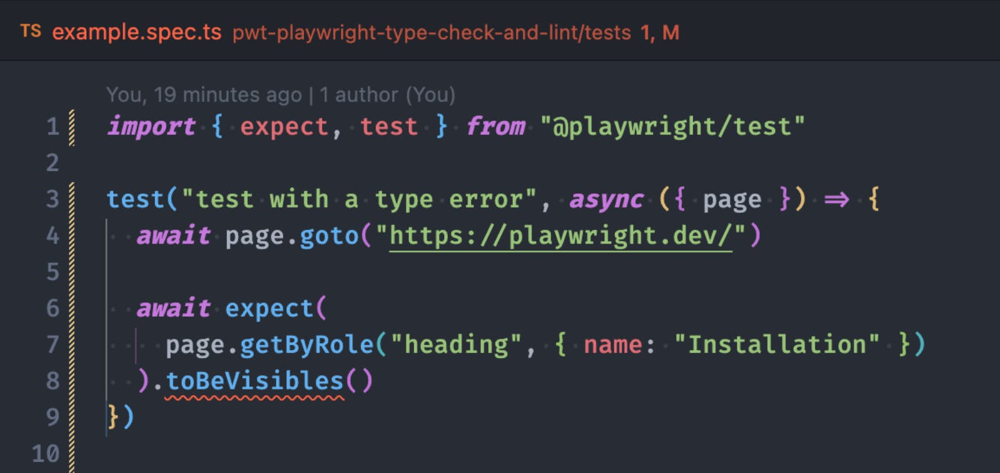
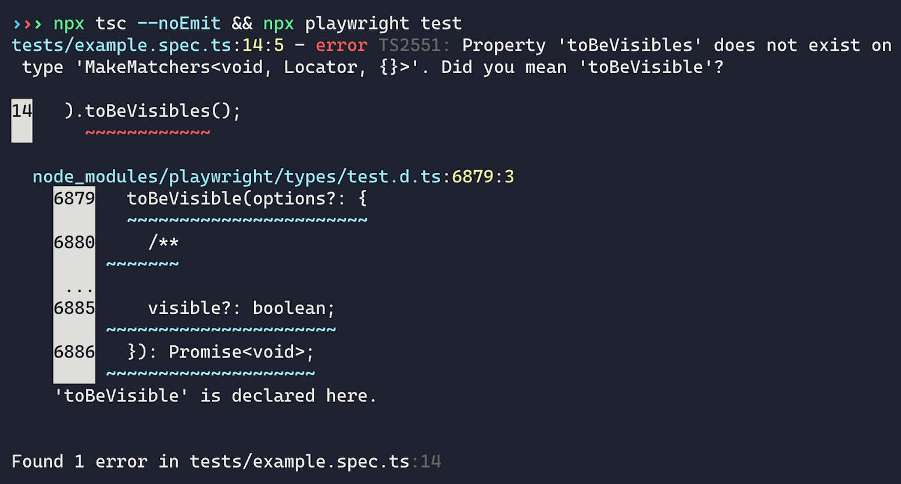

+++
date = 2024-07-25
title = "如何为playwright项目添加强类型检查和Linting"
description = "非常推荐的配置，可以有效的增加协作效率"
authors = ["乙醇"]
[taxonomies]
tags = ["playwright进阶", "翻译"]
[extra]
math = false
image = "banner.jpg"
+++

如果你在使用端到端测试或者[综合监控](https://www.checklyhq.com/product/synthetic-monitoring/)，很可能你正在使用[Microsoft的Playwright](https://playwright.dev/)。如果你的工具链中包含Playwright，你可能也采用了TypeScript。这是个简单的选择，因为它提供了稳定的自动补全和类型安全。

有了这套配置，你就可以享受出色的开发体验(DX)，并且在重构不断增长的代码库时，不用担心因为TypeScript的类型检查而出现运行时异常，对吧？**大错特错！**

这里有[Playwright文档中的一段话](https://playwright.dev/docs/test-typescript#introduction)：

> _注意，Playwright不会检查类型，即使存在非关键的TypeScript编译错误，它也会运行测试。_

没错！当你运行`npx playwright test`时，Playwright会把你的`*.spec.ts`文件转换成JavaScript并运行它们。这个过程中没有类型检查。

你可以自己试试。这里有一个简单的spec.ts文件示例。

```javascript
// ⚠️ 这个示例代码包含错误！
// 请不要直接复制粘贴。
import { expect, test } from "@playwright/test";


test("test with a type error", async ({ page }) => {
  await page.goto("https://playwright.dev/");


  await expect(
    page.getByRole("heading", { name: "Installation" })
  ).toBeVisibles();
});
```

这个测试包含一个明显的错误，如果你运行`npx playwright test`，你会看到以下结果。


糟糕！`toBeVisible()`断言拼写错误，导致测试失败。TypeScript不是应该防止这种情况吗？是的，这正是类型检查的用途，但让我再强调一遍：**Playwright不会检查你的类型，也没有内置的类型安全机制。**

但是当你编写端到端测试时，你确实看到了类型错误；这是怎么回事呢？

如果你使用现代编辑器，TypeScript通常已经集成其中，会在后台为任何打开的.ts文件运行。你编写测试时，会得到一些提示，享受自动补全功能，当出错时会看到常见的红色波浪线。



你的编辑器显示TypeScript错误是因为它善意地为你做了繁重的工作。而Playwright则没有为你提供保护。它编译你的代码时不关心是否存在类型不匹配或"undefined is not a function"等错误。Playwright仍会运行你的测试。没有安全保障，也没有额外帮助。

这个"缺失的功能"对小项目来说可能没问题，但请记住，**对于大型复杂项目，类型安全是无价的**。

想象一个高级测试套件，包含数百个测试、数十个POM（页面对象模型）以及更多实用函数：当你做一个小改动时，你可能只会在本地运行部分测试，然后推送代码到CI/CD运行所有测试。当你使用没有类型检查的TypeScript时，你只有在CI流水线启动浏览器运行测试后才会发现拼写错误和重构问题。你会浪费时间，而浪费多少取决于你项目的复杂程度。

让我们消除这种不确定性，重新让Playwright项目变得类型安全，并添加[typescript-eslint](https://typescript-eslint.io/)来避免最常见的Playwright错误。

让我们开始吧！

[最终代码在GitHub上](https://github.com/checkly/playwright-examples/tree/main/pwt-playwright-type-check-and-lint)

使用`npm init playwright@latest`命令启动新的Playwright项目后，你会发现引导项目只有很少的依赖项。值得一提的只有`@playwright/test`。尽管我喜欢精简的项目，但我更看重开发安全性。

让我们继续安装TypeScript作为新的`devDependency`。

```bash
# 安装`typescript`作为devDependency
npm install --save-dev typescript
```

你的`package.json`现在应该如下所示。

```json
{
  "name": "pwt-playwright-type-check-and-lint",
  "version": "1.0.0",
  "main": "index.js",
  "scripts": {},
  "keywords": [],
  "author": "",
  "license": "ISC",
  "description": "",
  "devDependencies": {
    "@playwright/test": "^1.45.3",
    "@types/node": "^20.14.11",
    "typescript": "^5.5.4"
  }
}
```

安装TypeScript后，`tsc`命令在你的项目中可用，现在你可以运行`npx tsc --init`来创建`tsconfig.json`。

```json
{
  "compilerOptions": {
    "target": "es2016",
    "module": "commonjs",
    "esModuleInterop": true,
    "forceConsistentCasingInFileNames": true,
    "strict": true,
    "skipLibCheck": true
  }
}
```

创建的`tsconfig.json`包含大量配置选项和关于不同TypeScript功能的注释。我们不会在这篇文章中深入探讨TypeScript的细节，因为我们只想捕获一些简单的类型错误。保持原样即可；默认配置足够了。

有了新的TypeScript配置文件，你可以开始从命令行运行类型检查。

```
# 运行类型检查，如果成功则运行Playwright
npx tsc --noEmit && npx playwright test
```

`tsc`命令会自动使用你现有的配置文件。`--noEmit`标志指示编译器不要将`*.ts`文件编译成JavaScript（Playwright仍会为你做这件事），而只执行类型检查。

现在看看结果！



通过在`playwright test`之前运行`tsc --noEmit`命令，你刚刚为Playwright项目添加了类型安全。TypeScript做了它擅长的事（抱怨），并告诉我们我们搞砸了。它甚至提供了我们错在哪里的建议。太棒了！

当然，你不会想手动运行这些命令。让我们把它们包装并拆分成npm脚本，使它们更容易区分。

```json
{
  "scripts": {
    "pretest": "tsc --noEmit",
    "test": "playwright test"
  }
}
```

多亏了`pre*` npm生命周期脚本约定，你可以用一个命令运行多个脚本。当你运行`npm run test`时，`pretest`脚本会先运行，只有在它成功后`test`脚本才会执行。先类型检查，然后用真实浏览器进行端到端测试。酷！

既然为Playwright项目添加类型检查并不难，我们就此停止吗？

当然不！现在我们有了`pretest`步骤，让我们也引入TypeScript linting。它将帮助我们在运行测试代码之前捕获常见的Playwright错误。相信我，额外的linting步骤绝对值得！

[为你的Playwright项目添加TypeScript linting](https://www.checklyhq.com/blog/playwright-type-checking-and-linting#add-typescript-linting-to-your-playwright-project)
--------------------------------------------------------------------------------------------------------------------------------------------------------------------------

类型检查有助于避免明显的运行时异常，但用户错误呢？如果你错误地使用Playwright，你的错误不会导致测试崩溃，而只是使它们失败怎么办？

TypeScript linting将把你的Playwright测试提升到新的水平，你再也不用眯着眼睛寻找这些难以发现的Playwright错误了。

### [最常见的Playwright错误 — 不正确的Promise使用](https://www.checklyhq.com/blog/playwright-type-checking-and-linting#the-most-common-playwright-mistake-incorrect-promise-usage)

你可能知道Playwright依赖JavaScript的Promise。测试运行器和核心库为你隐藏了所有异步魔法，多亏了`async/await`，测试用例看起来像是在运行同步操作。

但在底层，有大量的异步自动等待发生，很容易遗漏`await`或者过度使用`await`。

让我们看另一个例子。这次包含了我在与客户交流时经常看到的两个错误。

```javascript
// ⚠️ 这个示例代码包含错误！
// 请不要直接复制粘贴。
test("test with incorrect promise handling", async ({ page }) => {
  await page.goto("https://playwright.dev/")


  // 这个`await`是不必要的 
  const button = await page.getByRole("link", { name: "Get started" })
  // 这个`click()`需要await
  button.click()
})
```

最常见的两个Playwright错误是**将同步方法当作异步方法处理**或**将异步方法当作同步方法处理**。

```javascript
// Playwright定位器是同步的，
// 它们会在与操作和web优先断言一起使用时被评估
// -> 它们不需要`await`

// 正确
const button = page.getByRole('button');
// 错误
const button = await page.getByRole('button');

// -----
 
// 操作（`click()`）、web优先断言（`expect().toBeVisible()`）
// 和`test.step()`等方法是异步的
// -> 它们需要`await`
const button = page.getByRole('button');
await button.click()
```

这些错误的棘手之处在于它们经常导致不可预测的行为。有时它们会立即使你的测试失败，有时由于某些竞态条件，它们可能会正常工作。

不正确的Promise处理会导致不稳定性，很容易引发一整个下午的bug追踪之旅。

幸运的是，一些linting可以帮上忙。

### [为你的Playwright项目添加typescript-eslint](https://www.checklyhq.com/blog/playwright-type-checking-and-linting#add-typescript-eslint-to-your-playwright-project)

`typescript-eslint`是一个流行的TypeScript linter，也是[Playwright团队推荐的](https://playwright.dev/docs/best-practices#lint-your-tests)。它能帮助解决这两个错误吗？当然可以！

让我们安装更多的开发依赖。

```
# 安装`typescript-eslint`依赖
npm install --save-dev eslint @eslint/js @types/eslint__js typescript-eslint
```

`typescript-eslint`依赖于[ESLint](https://eslint.org/)，所以我们必须安装它并添加一些额外的类型。

安装完这些后，我们可以按照[入门指南](https://typescript-eslint.io/getting-started#step-2-configuration)在项目根目录创建一个`eslint.config.mjs`。

```javascript
// @ts-check

import eslint from '@eslint/js';
import tseslint from 'typescript-eslint';

export default tseslint.config(
  eslint.configs.recommended,
  ...tseslint.configs.recommended,
);
```

这个配置文件设置了ESLint和`typescript-eslint`推荐的配置。你不用担心这些细节。现在你可以开始用`npx eslint tests/**`来检查你的基于TypeScript的Playwright代码了。你会看到…


…什么都没有。我们的错误在运行linting时还没有显示出来。为什么？因为我们还没有开启"高级TypeScript"linting。

`typescript-eslint`支持所谓的["带类型信息的Linting"](https://typescript-eslint.io/getting-started/typed-linting/)。这个功能使linter能够理解底层的类型信息。如果你启用它，ESLint不仅会检查格式和语法规则，还会理解并评估你的代码。

_要使带类型信息的linting生效，你必须在`eslint.config.mjs`文件中定义TypeScript设置。幸运的是，我们已经创建了一个`tsconfig.js`，所以你可以像下面这样指定`languageOptions`。_

对Playwright项目最有价值的规则是[no-floating-promises](https://typescript-eslint.io/rules/no-floating-promises/)和[await-thenable](https://typescript-eslint.io/rules/await-thenable/)。让我们把它们加进去。

```typescript
// @ts-check

import eslint from "@eslint/js";
import tseslint from "typescript-eslint";

export default tseslint.config(
  eslint.configs.recommended,
  ...tseslint.configs.recommended,
  {
    // 定义TS项目配置以启用"带类型信息的linting"
    languageOptions: {
      parserOptions: {
        // 重用现有的`tsconfig.json`
        project: true,
        tsconfigRootDir: ".",
      },
    },
    // 启用对Playwright项目有益的linting规则
    rules: {
      "@typescript-eslint/no-floating-promises": "error",
      "@typescript-eslint/await-thenable": "error",
    },
  }
);
```

现在如果你运行`npx eslint tests/**`，你的新linter将捕获两个最常见的Playwright错误。


让我们再整理一下，将linting步骤添加到我们的`pretest`脚本中来完成设置。

```json
{
  "scripts": {
    "pretest": "tsc --noEmit && eslint tests/**",
    "test": "playwright test"
  }
}
```

现在当你用`npm run test`运行Playwright测试时，你的代码会在浏览器打开之前进行类型检查和linting。这种方法不仅会让你的测试更安全，还能帮助你更快地发现错误。这意味着你可以停止浪费那些不必要的CI/CD分钟来发现拼写错误！

## 结论

但让我们现实一点：这些项目依赖和配置文件值得吗？

当运行一个小型端到端测试项目时，没有这些安全措施也可以。但当你开始扩展Playwright，编写页面对象模型，并运行大量测试时，你应该押注于所有可以获得的安全措施。

仅仅依赖编辑器中的一些红色波浪线无法帮助你驾驭复杂的测试设置。如果你还不相信，当你因为一次重大的代码重构而陷入无休止的CI/CD测试循环时，你就会明白这一点了。祝你好运！

但如果你想采用类型检查和linting，[你可以在GitHub上找到示例代码](https://github.com/checkly/playwright-examples/tree/main/pwt-playwright-type-check-and-lint)。

同时请记住，**对预览部署进行端到端测试并不能保证生产环境正常运行**。唯一能让你安心睡觉的方法是[持续运行Playwright测试，并在出现问题时收到警报](https://www.checklyhq.com/product/synthetic-monitoring/)。

不过，既然你已经看到了Checkly的博客，你应该已经知道这一点了。😉

## 来源

[原文地址](https://www.checklyhq.com/blog/playwright-type-checking-and-linting)