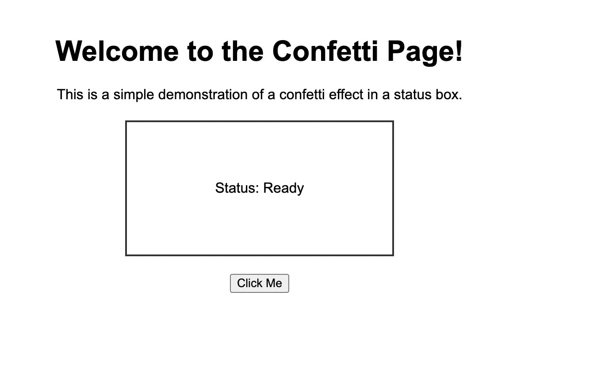
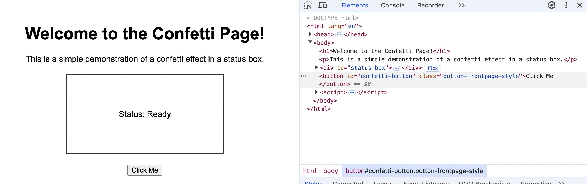
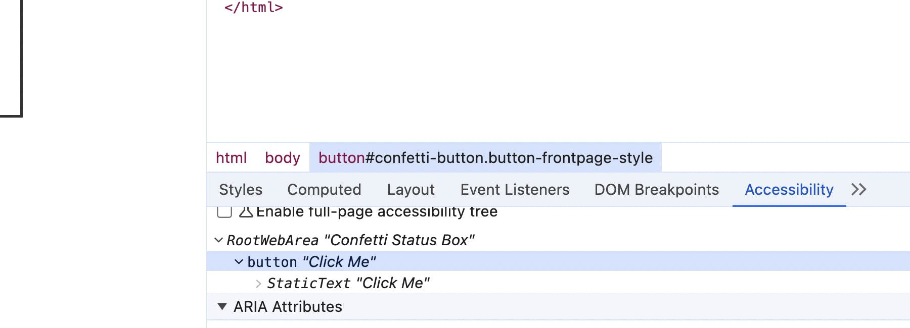
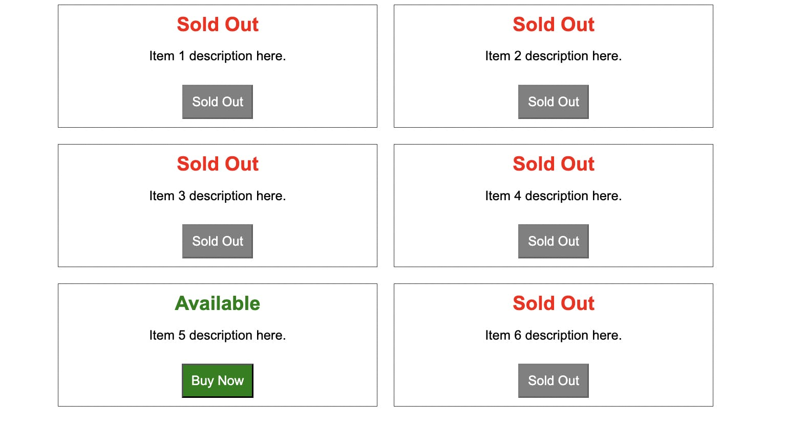

+++
date = 2024-08-20
title = "如何使用Playwright的用户优先选择器提升端到端测试的稳定性"
description = "很有道理，不过我还是喜欢css selector"
authors = ["乙醇"]
[taxonomies]
tags = ["playwright进阶", "翻译"]
[extra]
math = false
image = "banner.jpg"
+++


在使用Playwright进行网站端到端测试和监控时,选择恰当的定位器至关重要。优秀的定位器能帮助我们创建更稳定、更可靠的测试。本文将深入探讨用户优先定位器,并介绍如何通过筛选定位器来打造更健壮的测试。

场景示例
--------------------

让我们从一个简单的网页开始,它包含一个标题、一个按钮和一个状态更新框。当用户点击按钮时,状态会更新并伴随彩纸效果。下面我们来看看如何测试这个页面。



### 为什么我们要避免使用CSS选择器定位页面元素

如果你习惯于使用jQuery等传统的自动化和页面操作工具,你可能会倾向于使用CSS选择器。确实,如果我们检查这个页面,会发现按钮上有一个可以用于选择的class。



我们可以用`await page.locator("button.button-frontpage-style").click()`这样的代码来点击按钮,这种方法虽然可行,但并不推荐。

那么,这种方法有什么问题呢?

* 用户看页面是为了找按钮,而不是CSS类。使用CSS选择器的测试无法真实模拟用户行为。
* 如果前端开发者出于样式考虑将类名改为`button-hero-panel-style`,我们的测试就会出现假阳性,在实际没有问题的情况下报错。
* 如果按钮文本来自CMS且出现问题,变成了"HEROBUTTON_TXT",我们的测试仍会通过,尽管用户界面已经损坏,这就是假阴性。
* 基于以上原因,Playwright项目建议避免使用CSS定位器。遵循项目设定的标准是明智之选!

抛弃CSS选择器,拥抱用户优先定位器
------------------------------------------------------------------

Playwright提供了一系列基于页面角色的[定位器](https://playwright.dev/docs/locators),这比基于CSS或HTML的查找方式更贴近实际功能。使用内置的`getByRole`、`getByText`和`getByLabel`等定位器,它们在测试中的表现与用户实际操作一致,无论用户使用的是小众浏览器、移动设备,还是屏幕阅读器。

用户优先定位器实战
----------------------------------------

让我们用`getByRole`替换`page.locator`,通过按钮的角色和可访问名称来定位:

`await page.getByRole('button', { name: 'click me' }).click();`

你可以使用Chrome开发者工具来检查元素,找出它们的可访问性角色和名称。



这种方法确保了即使类名或HTML结构发生变化,测试仍然稳定可靠。

值得一提的是,Playwright的名称匹配不区分大小写,并支持子字符串匹配。这意味着你可以将选择器简化为`{ name: 'click' }`,即使营销团队将按钮文本改为"Click me now!",测试也能通过。

这种改进使得当按钮文本变成"HEROBUTTON_TXT"这样的无意义内容时,测试会如预期那样失败。

### 当`getByRole`和`getByLabel`失效时该怎么办

我之所以推荐用户优先定位器,部分原因在于当你发现这些选择器在页面上不起作用时会发生什么。如果页面上的许多元素没有设置角色和标签,或者所有元素都使用相同的标签和角色,这表明你的页面存在严重的可访问性问题。没有唯一标识的元素意味着屏幕阅读器和键盘导航工具将无法正常工作,导致很多用户无法顺利浏览你的网站。这应该成为开发团队和质量保证团队讨论如何改善页面结构的契机,不仅能解决测试问题,还能提升所有用户的使用体验。

短期内,你可以查看Playwright提供的所有定位器,肯定能找到合适的方法定位任何元素。但我建议你将此作为未来讨论技术债务的起点。

如何处理多重匹配元素
--------------------------------------------

当一个定位器匹配到多个元素时,Playwright的严格模式会触发失败。例如,使用`getByRole('button')`可能会匹配到多个按钮。你可能会看到这样的错误信息:

`Error: locator.click: Error: strict mode violation: getByRole('button', { name: 'click' }) resolved to 2 elements:`

注意,在严格模式下,即使第一个结果或所有结果都能通过测试的其他部分,这个测试也会失败。解决方法是指定位置或筛选元素。

### 基于位置的选择

当首次遇到这个错误时,最简单的解决方案是指定列表中的位置。最常见的做法是选择第一个结果:

`await page.getByRole('button').first().click();`

我经常遇到上述错误,以至于养成了习惯,几乎每次写定位器时都会添加`first()`。😅

如果你想更精确地指定列表位置,可以使用:

`await page.getByRole('button').nth(3).click();`

`.nth()`函数是从0开始索引的,所以`.nth(3)`会选择结果中的第四个项目。位置选择器虽然有效,但可能不够稳定。如果页面内容是动态的,选择第一个以外的结果可能会导致假阳性。为了确保在动态列表中准确定位到正确的元素,我们需要进行更细致的元素筛选。

Playwright中的元素筛选技巧
--------------------------------------------------------

想象一个电商网站界面,展示了多个商品,但只有部分可购买。在这种情况下,仅依赖位置选择器进行测试显然不够可靠。



检查页面后,我们发现这些是列表项。以下是一个更智能的选择器,它首先确保商品可购买,然后再定位到"购买"按钮:

```javascript
const button = page.getByRole('listitem')
  .filter({ hasText: 'available' })
  .getByRole('button', { name: 'buy' });
await button.click();
```

这个测试现在能够在用户预期的情况下失败:当所有商品都显示为售罄时。

定位器策略最佳实践
----------------------------------------

对于定位器,没有放之四海而皆准的解决方案。以下是一些实用建议:

* **避免依赖实现细节**: 使用反映用户行为而非HTML结构的定位器。
* **善用内置定位器**: `getByRole`、`getByText`等定位器能显著提高测试的稳定性和可维护性。
* **合理使用数据测试ID**: 在复杂场景中,使用数据测试ID可以简化定位器并提高测试可靠性。但要注意,仅用于调试的页面内容应该谨慎使用。


