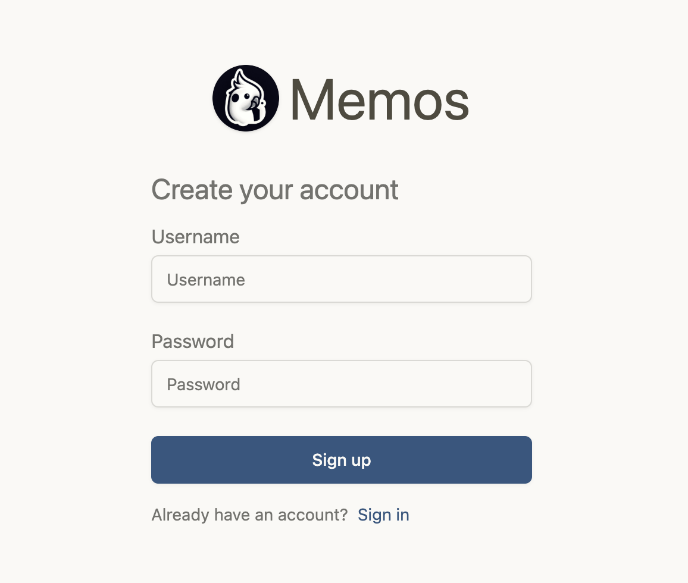
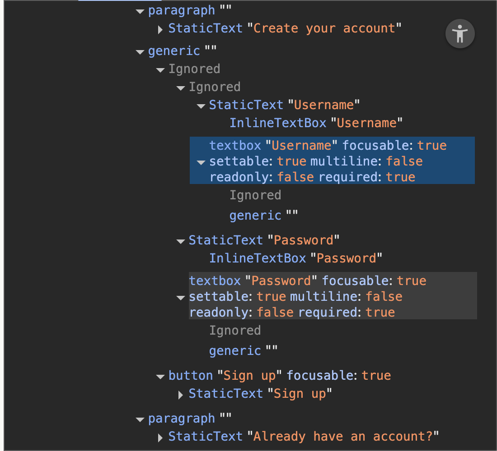
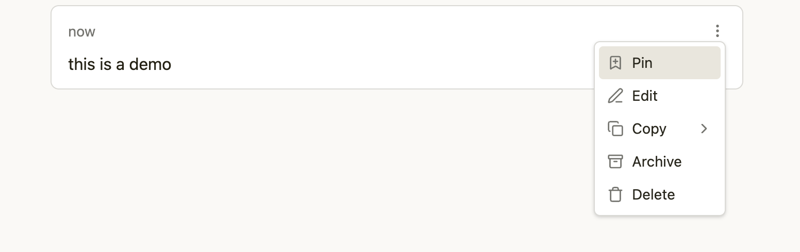
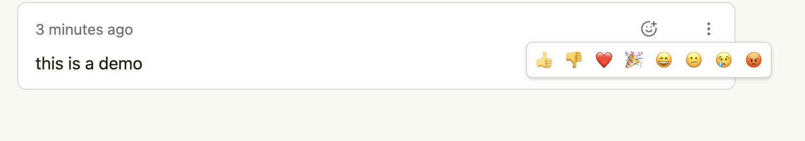
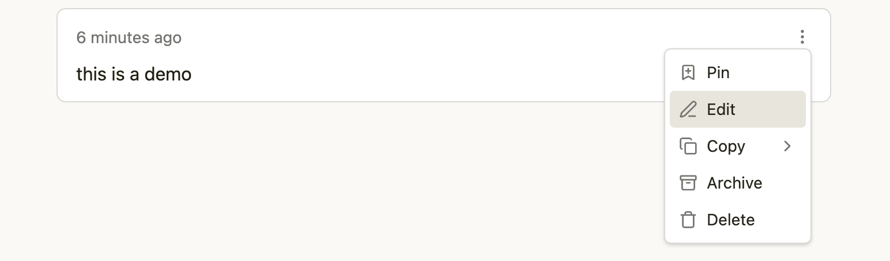
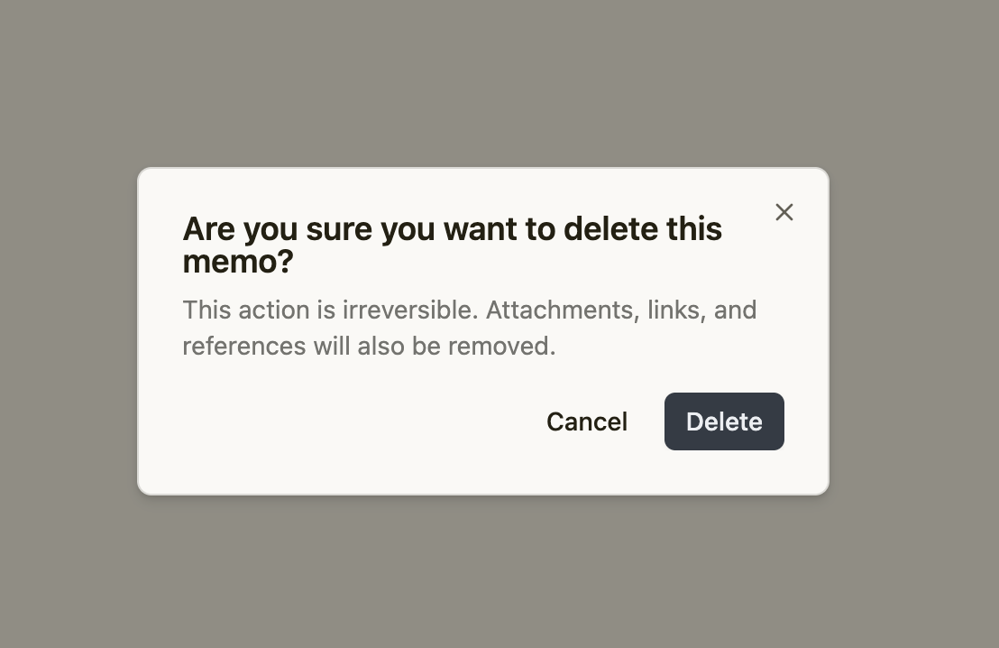

+++
date = 2026-01-31
title = "playwright 2026 实操教程"
description = "2026年初如何手写自动化流程"
authors = ["乙醇"]
[taxonomies]
tags = ["playwright基础", "原创"]
[extra]
math = false
image = "playwright_2026_b.png"
+++

2026年初，浏览器自动化基本上都是AI工具帮我们代劳了。

Selenium 系方案在面对现代网站的指纹检测、行为分析、WAF 时越来越吃力，而 **Playwright** 凭借原生多内核支持、极致 API 友好度、社区活跃，已经稳坐头把交椅。

今天我们就反其道而行之，从零开始，手写一套**针对真实应用的自动化流程**。

我们的测试对象是开源自托管笔记服务 **Memos**（https://github.com/usememos/memos）。

## 为什么选 Memos 做 demo？

- 到2026年1月，它已经有 **56k+ stars**，社区非常活跃（最新稳定版 v0.25.3，2025年11月发布）
- 极简、隐私优先、自托管、无遥测、无广告、MIT 开源
- 部署简单（Docker 一行搞定），界面现代、响应式、支持手机
- 有完备的 **REST API**，但我们这次主要用 Playwright 走**浏览器端**操作，模拟真人用户行为（后续可对比 API 方式）
- 功能覆盖典型笔记场景：登录、写 memo、加标签、@提及、搜索、公开/私有切换、附件上传等，非常适合拿来练手和展示 Playwright 的各种能力

### Memos 核心功能快速过一遍（我们将自动化其中的一些操作）

- 原子化短笔记（memo）：每条像数字便签，支持 Markdown（代码、表格、任务列表、链接预览）
- 标签（#work #idea）、@提及、内部链接，方便知识联网
- 可见性控制：公开 / 仅自己 / 保护（密码）
- 搜索 + 标签过滤 + 日历视图
- 附件上传（图片、文件）
- 归档、置顶、删除、恢复
- 暗黑模式 + 移动端友好
- 自托管后数据完全本地掌控（SQLite/MySQL/PostgreSQL）

## 安装memo

**快速自建一个 Memos 测试环境**（推荐 Docker，5 分钟内搞定）：

```bash
docker run -d \
  --name memos-demo \
  -p 5230:5230 \
  -v ~/memos-data:/var/opt/memos \
  --restart unless-stopped \
  neosmemo/memos:stable
```

启动后访问 `http://localhost:5230`，注册第一个账号，就能得到一个干净的实例。我们后续所有自动化代码都针对这个本地 Memos 来写。

## 安装 Playwright（Python 版，2026年推荐方式）

```bash
# 1. 升级 pip（规避很多隐蔽问题）
pip install --upgrade pip

# 2. 安装核心 + pytest 插件（写测试用很方便）
pip install playwright pytest-playwright

# 3. 下载浏览器（约 300–500MB，建议开代理/科学网络）
playwright install

# 省空间只装 chromium：
# playwright install chromium
```

快速验证安装成功：

```python
from playwright.sync_api import sync_playwright

with sync_playwright() as p:
    browser = p.chromium.launch(headless=False)
    page = browser.new_page()
    page.goto("http://localhost:5230")  # 改成你的 Memos 地址
    print(page.title())                 # 应该看到 "Memos" 或类似标题
    browser.close()
```

浏览器弹出并能访问本地 Memos → 环境就绪。

## 登录与注册

注册和登录用到了几乎相同的元素，所以我们直接用Page Object模式来实现。

### 界面



### html



### 实现代码

```python
import re
from playwright.sync_api import Playwright, sync_playwright, expect
import time

class AuthPage():
    def __init__(self, page):
        self.page = page
        self.username = page.get_by_role("textbox", name="Username")
        self.password = page.get_by_role("textbox", name="Password")
        self.sign_up_btn = page.get_by_role("button", name="Sign up")
        self.sign_in_btn = page.get_by_role("button", name="Sign in")

    def login(self, username, password):
        self.page.goto("http://localhost:5230/auth/")
        self.username.wait_for(state="visible", timeout=2000)

        self.username.fill(username)
        self.password.fill(password)
        time.sleep(1)
        self.sign_in_btn.wait_for(state="visible", timeout=2000)
        self.sign_in_btn.click()
        time.sleep(1)

    def signup(self, username, password):
        self.page.goto("http://localhost:5230/auth/signup")
        self.username.wait_for(state="visible", timeout=2000)

        self.username.fill(username)
        self.password.fill(password)
        self.sign_up_btn.click()

def run(playwright: Playwright) -> None:
    browser = playwright.chromium.launch(headless=False)
    context = browser.new_context()
    page = context.new_page()

    username = "sample"
    password = "demo"

    auth_page = AuthPage(page)
    auth_page.signup(username, password)
    # auth_page.login(username, password)


    input("Press Enter...")

    # ---------------------
    context.close()
    browser.close()


with sync_playwright() as playwright:
    run(playwright)

```

### 免登录

免登录的原理是在浏览器里设置一个cookie，下面是示例代码，依然是po模式。

```python
def login_with_session(self, session):
    print("login....")
    self.page.goto("http://localhost:5230/auth", wait_until="domcontentloaded")
    time.sleep(1)
    self.page.context.add_cookies([
        {
            "name": "user_session",
            "value": session,
            "url": "http://localhost:5230"  # 必须与页面同源
        }
    ])
    self.page.goto("http://localhost:5230", wait_until="domcontentloaded")
```

调用方式如下。

```python
def run(playwright: Playwright) -> None:
    browser = playwright.chromium.launch(headless=False)
    context = browser.new_context()
    page = context.new_page()

    username = "sample"
    password = "demo"

    auth_page = AuthPage(page)
    auth_page.login_with_session('在浏览器的Application -> Cookies里面能找到')


    input("Press Enter...")

    # ---------------------
    context.close()
    browser.close()


with sync_playwright() as playwright:
    run(playwright)

```

## 创建memo

### 界面


代码如下。

```python
def create_memo(page, content: str):
    # create memo
    page.goto("http://localhost:5230")
    page.get_by_role("textbox", name="Any thoughts...").wait_for(state="visible", timeout=2000)
    page.get_by_role("textbox", name="Any thoughts...").fill(content)
    time.sleep(1)
    page.get_by_role("button", name="Save").click()

```

这里要注意的是我们需要等待输入框出现之后再进行操作。

## pin 和 unpin 第1条 memo

### 界面



代码如下

```python

def pin_and_unpin_memo(page):
    time.sleep(1)
    # pin
    page.locator('.lucide-ellipsis-vertical').first.click()
    page.get_by_role("menu").wait_for(state="visible", timeout=2000)
    page.get_by_role("menuitem", name="Pin").click()

    # unpin
    time.sleep(1)
    page.locator(".lucide.lucide-bookmark").first.click()
```

这里如何定位3个小竖点比较困难，我是用的`css selector`。

也就是这行代码`page.locator('.lucide-ellipsis-vertical').first.click()`。

另外弹出的menu也要等待，毕竟代码运行的速度比浏览器动画的速度要快。

## 增加 reaction

### 界面



代码如下。

```python
def add_reaction(page, reaction: str):
    time.sleep(1)
    page.locator("relative-time").first.hover()
    page.locator(".lucide.lucide-smile-plus").first.wait_for(state="visible", timeout=2000)
    page.locator(".lucide.lucide-smile-plus").first.click()
    time.sleep(1)
    page.get_by_role("dialog").wait_for(state="visible", timeout=2000)
    page.get_by_role("dialog").get_by_text(reaction).click()

```

使用的时候是这样的`add_reaction(page, "❤️")`，可以点击任意的表情。

这里的难点是先要hover到一个元素上，然后再等待弹出框。

## 编辑第1条 memo

### 界面



代码如下。

```python
def edit_memo(page, content: str):
    page.locator('.lucide-ellipsis-vertical').first.click()
    page.get_by_role("menu").wait_for(state="visible", timeout=2000)
    page.get_by_role("menuitem", name="Edit").click()

    page.get_by_role("textbox", name="Any thoughts...").nth(1).fill(content)
    time.sleep(1)
    page.get_by_role("button", name="Save").nth(1).click()
```

`page.get_by_role("textbox", name="Any thoughts...").nth(1)`这行代码是定位页面上第2个文本框，也就是编辑的那个多行文本框。

## 删除

### 界面



删除是会弹出对话框的，要等待这个对话框出现才能继续操作。

```python

def delete_memo(page):
    page.locator('.lucide-ellipsis-vertical').first.click()
    page.get_by_role("menu").wait_for(state="visible", timeout=2000)
    page.get_by_role("menuitem", name="Delete").click()

    page.get_by_role("dialog", name="Are you sure you want to").wait_for(state="visible", timeout=2000)
    page.get_by_role("button", name="Delete").click()

```

## 上传文件

这里的原理是找到页面上隐藏的`input[type="file"]`的控件，然后直接设置文件的绝对路径。

上传文件的时候会遇到系统对话框，这个处理起来比较麻烦，所以不要跟界面纠缠，直接操作隐藏控件就好。

```python
page.locator('input[type="file"]').first.set_input_files("./pic.jpg")
page.get_by_role("button", name="Save").click()
```

## 完整代码

```python
import re
from playwright.sync_api import Playwright, sync_playwright, expect
import time

class AuthPage():
    def __init__(self, page):
        self.page = page
        self.username = page.get_by_role("textbox", name="Username")
        self.password = page.get_by_role("textbox", name="Password")
        self.sign_up_btn = page.get_by_role("button", name="Sign up")
        self.sign_in_btn = page.get_by_role("button", name="Sign in")

    def login(self, username, password):
        self.page.goto("http://localhost:5230/auth/")
        self.username.wait_for(state="visible", timeout=2000)

        self.username.fill(username)
        self.password.fill(password)
        time.sleep(1)
        self.sign_in_btn.wait_for(state="visible", timeout=2000)
        self.sign_in_btn.click()
        time.sleep(1)

    def signup(self, username, password):
        self.page.goto("http://localhost:5230/auth/signup")
        self.username.wait_for(state="visible", timeout=2000)

        self.username.fill(username)
        self.password.fill(password)
        self.sign_up_btn.click()

    def login_with_session(self, session):
        print("login....")
        self.page.goto("http://localhost:5230/auth", wait_until="domcontentloaded")
        time.sleep(1)
        self.page.context.add_cookies([
            {
                "name": "user_session",
                "value": session,
                "url": "http://localhost:5230"  # 必须与页面同源
            }
        ])
        self.page.goto("http://localhost:5230", wait_until="domcontentloaded")

def create_memo(page, content: str):
    # create memo
    page.goto("http://localhost:5230")
    page.get_by_role("textbox", name="Any thoughts...").wait_for(state="visible", timeout=2000)
    page.get_by_role("textbox", name="Any thoughts...").fill(content)
    time.sleep(1)
    page.get_by_role("button", name="Save").click()

def pin_and_unpin_memo(page):
    time.sleep(1)
    # pin
    page.locator('.lucide-ellipsis-vertical').first.click()
    page.get_by_role("menu").wait_for(state="visible", timeout=2000)
    page.get_by_role("menuitem", name="Pin").click()

    # unpin
    time.sleep(1)
    page.locator(".lucide.lucide-bookmark").first.click()

def add_reaction(page, reaction: str):
    time.sleep(1)
    page.locator("relative-time").first.hover()
    page.locator(".lucide.lucide-smile-plus").first.wait_for(state="visible", timeout=2000)
    page.locator(".lucide.lucide-smile-plus").first.click()
    time.sleep(1)
    page.get_by_role("dialog").wait_for(state="visible", timeout=2000)
    page.get_by_role("dialog").get_by_text(reaction).click()

def edit_memo(page, content: str):
    page.locator('.lucide-ellipsis-vertical').first.click()
    page.get_by_role("menu").wait_for(state="visible", timeout=2000)
    page.get_by_role("menuitem", name="Edit").click()

    page.get_by_role("textbox", name="Any thoughts...").nth(1).fill(content)
    time.sleep(1)
    page.get_by_role("button", name="Save").nth(1).click()

def delete_memo(page):
    page.locator('.lucide-ellipsis-vertical').first.click()
    page.get_by_role("menu").wait_for(state="visible", timeout=2000)
    page.get_by_role("menuitem", name="Delete").click()

    page.get_by_role("dialog", name="Are you sure you want to").wait_for(state="visible", timeout=2000)
    page.get_by_role("button", name="Delete").click()


def run(playwright: Playwright) -> None:
    browser = playwright.chromium.launch(headless=False)
    context = browser.new_context()
    page = context.new_page()

    username = "sample"
    password = "demo"

    auth_page = AuthPage(page)
    # auth_page.signup(username, password)
    # auth_page.login(username, password)
    auth_page.login_with_session("7-0baac506-9071-4d9b-ac72-158f83081c43")

    # create_memo(page, "my sample")
    # edit_memo(page, "✍️")
    # edit_memo(page)
    # add_reaction(page, "❤️")

    page.locator('input[type="file"]').first.set_input_files("./pic.jpg")
    page.get_by_role("button", name="Save").click()

    input("Press Enter...")


    # ---------------------
    context.close()
    browser.close()


with sync_playwright() as playwright:
    run(playwright)

```

## B站视频

<iframe src="//player.bilibili.com/player.html?isOutside=true&aid=115977303887884&bvid=BV1L66FB4EiV&cid=35683306523&p=1" scrolling="no" border="0" frameborder="no" framespacing="0" allowfullscreen="true"></iframe>

## YouTube视频

<iframe width="560" height="315" src="https://www.youtube.com/embed/dorzYojypAA?si=3a_YGIFF72O2r_vV" title="YouTube video player" frameborder="0" allow="accelerometer; autoplay; clipboard-write; encrypted-media; gyroscope; picture-in-picture; web-share" referrerpolicy="strict-origin-when-cross-origin" allowfullscreen></iframe>
