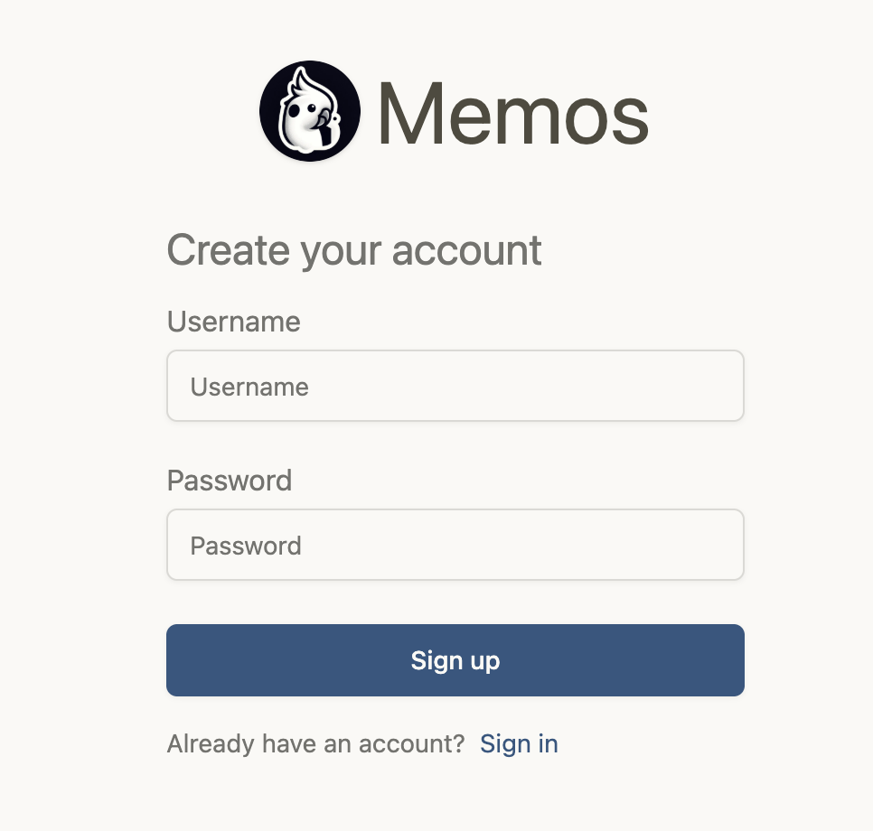
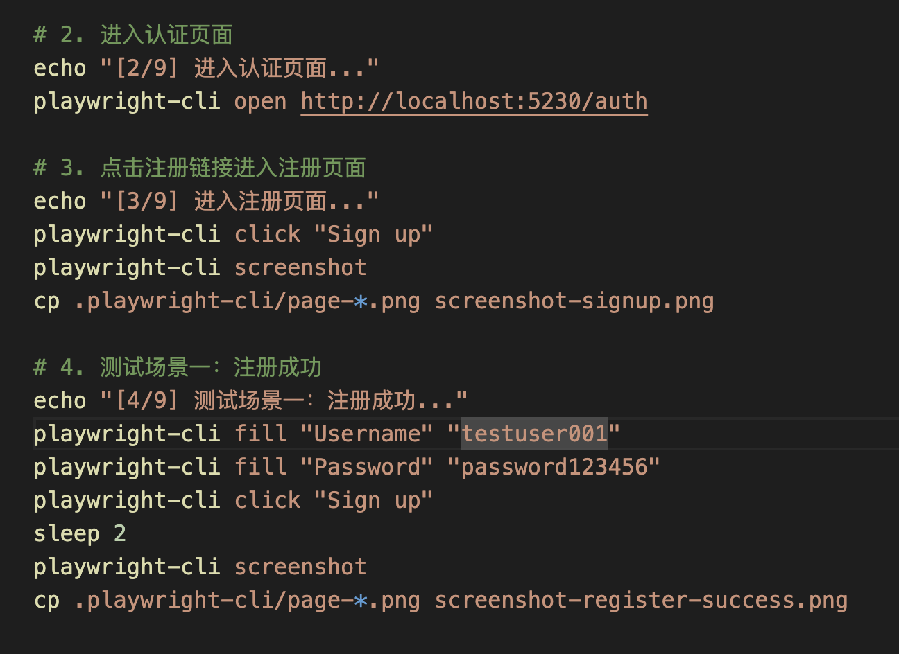
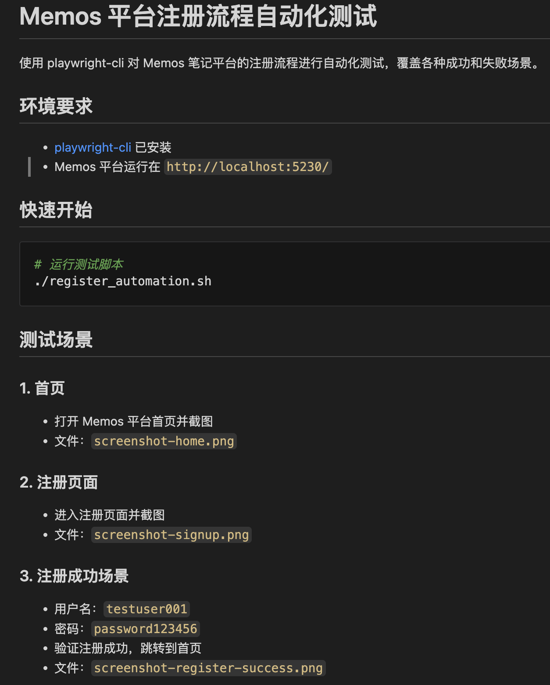
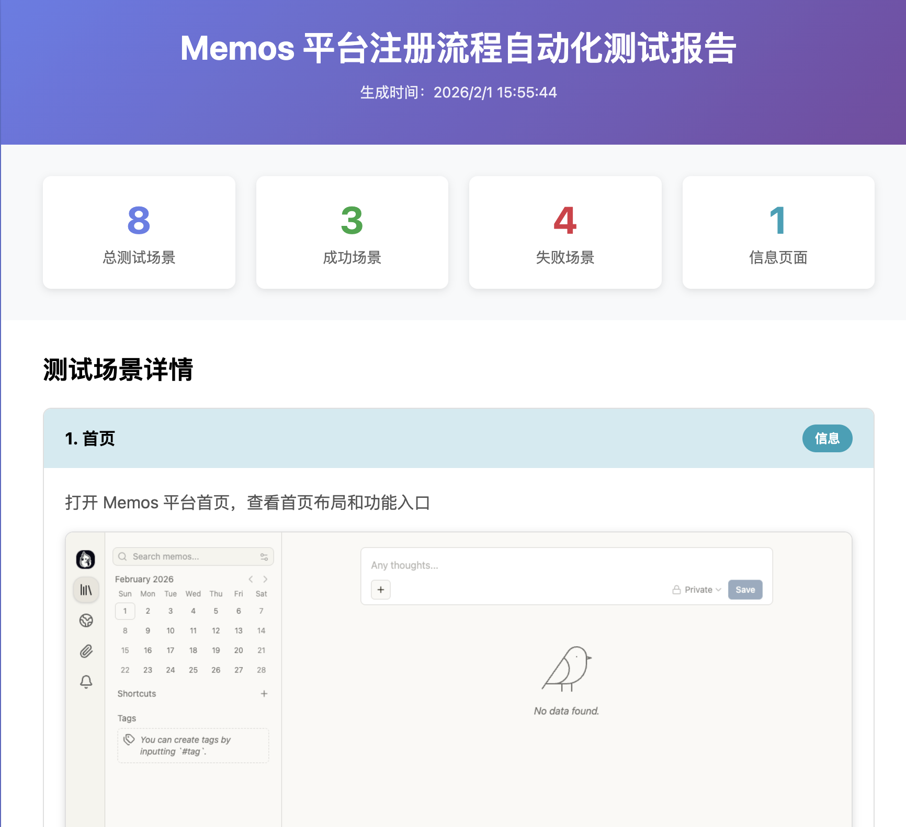

+++
date = 2026-02-01
title = "新的Agent Skills! Playwright CLI 初体验"
description = "用 playwright cli 来进行浏览器自动化操作"
authors = ["乙醇"]
[taxonomies]
tags = ["playwright基础", "AI", "video", "Skills", "playwright cli"]
[extra]
math = false
image = "cover.jpg"
+++

Playwright最新推出了[playwright cli](https://github.com/microsoft/playwright-cli)工具和相应的skills，可以适配大部分的AI coding agent。

这是1个官方提供的轻量级命令行工具，主要用来在终端直接控制浏览器执行自动化操作，而不需要自己写任何一行代码。

简单来说，它就是把 Playwright 最常用的几十个操作封装成了命令行指令，让AI agent可以用非常简短的命令来操控浏览器。

经过简单的试用，我发现时代真的变了，现在让agent干活基本就是几行像敲命令一样的短句，token省一大堆，调试也不用自己亲自动手。

估计80%简单的日常网页任务都可以直接搞定。

下面来看一下Playwright cli的真正实力吧。

## 前置条件

我使用的是[claude code](https://github.com/anthropics/claude-code)和 [GLM4.7](https://docs.bigmodel.cn/cn/guide/models/text/glm-4.7)模型。

## 安装plawyright cli

plawyright cli的安装非常方便，直接用npm就好了。

```
npm install -g @playwright/cli@latest
playwright-cli --help
```

## 安装skills

在cluade code里，我们可以直接使用plgin来安装

```
/plugin marketplace add microsoft/playwright-cli
/plugin install playwright-cli
```

## 使用playwright cli来测试memo

我们的测试对象是memo。

这是1个简单的笔记工具，之前的视频里有介绍过，这里就不展开了，就把它看成是一个自建的微博就好了。



## 具体过程

在命令行里运行`claude`命令，然后输入下面的提示词。

```
使用playwright skills 完成 http://localhost:5230/ 的自动化操作。

这是memo平台，一个笔记系统。

首先进行注册流程的自动化操作。

对所有成功和失败的场景进行截图

截图的文件放在当前目录，方便我查看。

另外用中文进行输出。
```

运行后claude会自己去读取playwright cli给的skill信息，属于一边运行一边进化了。

我本来是想让claude code完成一个简单的注册操作的，而不是写测试用例。

因为用例写起来场景相对比较多，会比较费token，呃，不对，会比较难一点。

结果claude不忘初心，毕竟playwright是用来测试的，直接给我生成了一连串的用例，让我大开眼界。

接着就是自动生成代码的传统艺能了。

经过了一系列紧张的测试，claude生成了测试报告，并且给出了一些测试发现。

我没去仔细验证啊，不过一眼看上去好像还挺靠谱的。

相当惊艳的探索性测试结论。

因为playwright cli默认是以无头的方式后台运行的，所以需要把测试的结果截图保存一下。

验证一下截图，看上去也没啥问题。

playwright cli的命令是可以重放的，所以我让ai直接把用到的命令都放到1个shell脚本里。这样下一次再进行测试的时候直接执行shell脚本就可以了，高效且准确，还能省token，获得稳定的结果。

ai不仅照做，还给了一些注释和命令行的输出，又一次超出预期了。



接着再让ai生成readme文件，方便我们人类和ai以后进行查看和理解。



最后再增加输出html格式报告的功能，增强项目的可视化能力。

手动运行一下生成的shell脚本，执行的很顺利，没有问题，最后打开报告。

这个报告的样式还行，比较清爽，不算惊艳，中规中矩吧。



## 总结

一句话总结：claude code + glm4.7 + playwright cli真的非常强，让人印象相当深刻。

2026年了，用自然语言去编写自动化测试用例这个目标看来真的已经实现了。

当然，这仅限于简单的场景，在复杂场景下的表现我没有测试，所以大家理性看待就好。
