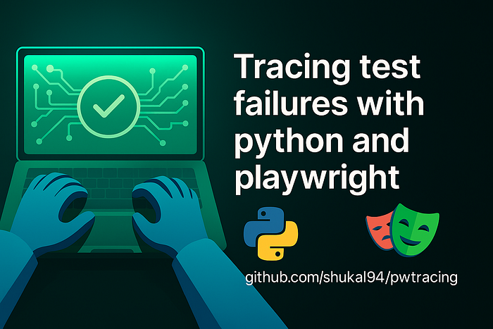
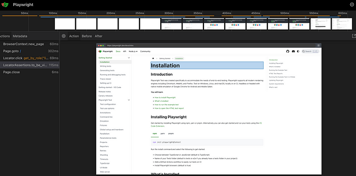
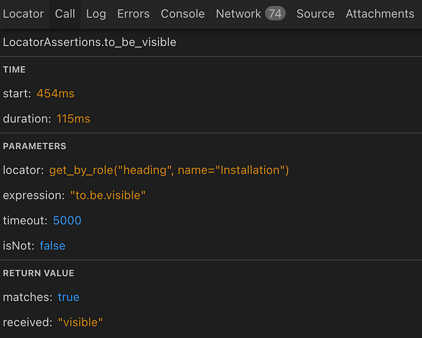
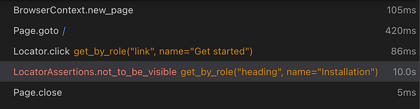
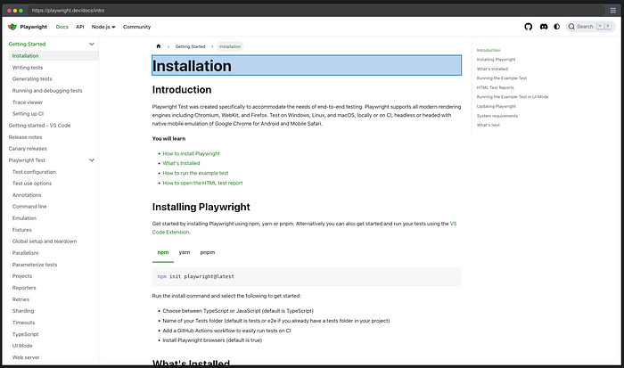
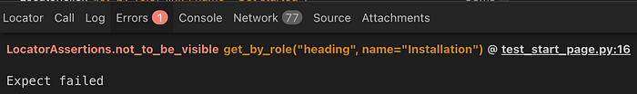
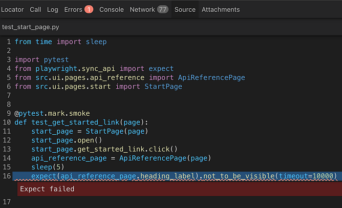

+++
date = 2025-06-11
title = "为什么 Playwright 的追踪功能比日志更适合调试 UI 测试用例"
description = "效率提高之选"
authors = ["乙醇"]
[taxonomies]
tags = ["playwright进阶", "翻译"]
[extra]
math = false
image = "banner.jpg"
+++

当你的 Python UI 测试失败时，日志往往让你一头雾水。而 Playwright 的追踪功能能清晰展示发生了什么——包括截图、DOM 快照和完整上下文。



**本文内容包括：**

- 为什么 Playwright 日志不够用
- 追踪功能能带来什么
- 为什么 `--tracing=on` 不生效
- 如何在 Python 中手动启用追踪
- GitHub Actions 的坑点（.开头的文件夹）
- macOS 解压导致的奇怪问题
- 我的心得体会——以及进阶课程推荐

不久前，我在 LinkedIn 上做了一项关于 Web UI 测试工具的投票。

与此同时，我开始使用 Playwright，并很快发现了一个出奇有效的调试方式：**内置追踪功能**。

乍一听可能觉得没什么，但相信我，我记得当年为了能在测试环境中实现基础的实时视频录制，付出了多少努力。直到现在，很多团队依然不使用视频或可追踪记录。最多只是在测试步骤中偶尔截图或输出一些日志。

在那之前，我花了很多时间使用 Selenium，甚至写过一篇关于如何用 Python 描述符清理 PageObject 的文章：

👉 [Python 描述符如何清理 PageObject，即使到了 2025](https://medium.com/@sergey.shukalovich/how-python-descriptors-clean-up-pageobjects-even-in-2025-12faa11b05b0)

但用了 Playwright 后我很快意识到：**光靠日志已经远远不够了**。

## **为什么 Playwright（Python）中的标准日志不够用？**

我们来看一个简单的 UI 测试：

```python
@pytest.mark.smoke
def test_get_started_link(page):
    start_page = StartPage(page)
    start_page.open()
    start_page.get_started_link.click()
    api_reference_page = ApiReferencePage(page)
    expect(api_reference_page.heading_label).to_be_visible()
```

当这段测试运行时，Playwright 默认输出的日志如下：

```
2025-06-10T21:36:20.707Z pw:api navigating to "https://playwright.dev/", waiting until "load"
...
2025-06-10T21:36:21.252Z pw:api locator resolved to <h1>Installation</h1>
```

看起来很详细？但**你试试看用这个来调试一个不稳定的 UI 测试**：

- **没有上下文**说明哪一步逻辑失败了
- 信息都非常底层：滚动、DOM 事件、加载状态……
- 不知道**断言失败点**，也不知道涉及哪个 page object
- **没有截图、没有 DOM 快照、没有测试名称、没有可追溯性**

比如你的测试失败在这句：

```python
expect(api_reference_page.heading_label).to_be_visible()
```

日志只会显示：

```
LocatorAssertions.to_be_visible with timeout 5000ms
```

除此之外——**一无所知**。

你完全不知道：

- 页面当时实际长啥样
- 是否导航完成
- page object 是否初始化成功

## **追踪功能能带来什么？**

我们再运行一次上面的测试——但这次启用 **Playwright Tracing**。

你将获得：

- **测试全过程的可交互时间线**
- 每个操作的截图
- 每步执行前后的 DOM 快照
- 控制台输出、网络请求及响应信息
- 可视化标记**哪一步失败**，并给出完整上下文

你可以通过以下命令打开 trace：

```bash
playwright show-trace traces/trace.zip
```

或在线打开：

👉 [https://trace.playwright.dev](https://trace.playwright.dev/)

效果大致如下：




## **失败时的追踪长这样**

举个刻意失败的例子：

```python
@pytest.mark.smoke
def test_get_started_link(page):
    start_page = StartPage(page)
    start_page.open()
    start_page.get_started_link.click()
    api_reference_page = ApiReferencePage(page)
    sleep(5)
    expect(api_reference_page.heading_label).not_to_be_visible(timeout=10000)
```

输出信息如下：

```
E AssertionError: Locator expected not to be visible
E Actual value: visible
E ...
```

这还是看不出：

- 浏览器到底展示了什么
- 当前页面是哪一个
- 是什么导致了失败

而在 Playwright trace viewer 中，同样的失败是这样的：







不用再去啃那 20 多行模糊日志，你可以**直观看到浏览器看到的内容，以及何时出现问题**。

## **为什么 `--tracing=on` 没有生成 trace（以及如何解决）**

Playwright 支持追踪功能，`pytest-playwright` 也提供了 CLI 参数：

```bash
pytest --tracing=on
```

看起来很简单？

但你运行后却发现：

- 没有文件
- 没有警告
- 没有 trace

**发生了什么？**

原因是 `--tracing=on` 只是告诉 Playwright **开始追踪**，却**没有告诉它停止并保存**。

除非你用的是 JavaScript 的测试 runner，**Python 不会自动调用：**

```python
context.tracing.stop(path="trace.zip")
```

所以 trace 根本不会保存到磁盘。

## **真实的 bug 报告**

不仅你遇到过这个问题，还有很多其他开发者：

- [actions/upload-artifact#447](https://github.com/actions/upload-artifact/issues/447)
- [playwright-pytest#179](https://github.com/microsoft/playwright-pytest/issues/179)
- [playwright-pytest#129](https://github.com/microsoft/playwright-pytest/issues/129)

## **解决方法：写一个自己的 fixture**

你可以在 `conftest.py` 中添加如下 fixture：

```python
TRACES_DIR_PATH = pathlib.Path.cwd().joinpath("artifacts").joinpath("traces")

@pytest.fixture(scope="function", autouse=True)
def trace_browser_context(config, browser_context):
    ui_config = config["ui"]
    save_trace = ui_config.getboolean("save_trace")

    if save_trace:
        browser_context.tracing.start(screenshots=True, snapshots=True, sources=True)

    yield

    if save_trace:
        browser_context.tracing.stop(path=TRACES_DIR_PATH.joinpath(f"trace-{uuid.uuid4()}.zip"))
```

确保你有 `config.ini` 配置，内容包含 `[ui] save_trace = true`，并且已定义 `browser_context` fixture。

这个 fixture 会：

- 在每个测试开始时启动追踪
- 在测试结束后（不论成功或失败）保存为唯一命名的 `.zip` 文件
- 可在本地和 CI 环境中使用

## **Bonus：可以进一步自定义 trace 策略**

你还可以扩展逻辑，比如：

- 只在失败时保存 trace
- 按测试场次分文件夹保存
- 附加到 CI artifacts（见下文）

完整代码参考 GitHub 仓库：

👉 [shukal94/pwtracing](https://github.com/shukal94/pwtracing)

## **CI 集成：GitHub Actions 配置**

你希望 CI 能够：

1. 运行测试
2. 收集追踪文件
3. 上传为可下载的 artifacts

`.github/workflows/playwright.yml` 示例：

```yaml
name: Playwright Tests

on:
  push:
    branches: [main]
  pull_request:
    branches: [main]

jobs:
  test:
    timeout-minutes: 60
    runs-on: ubuntu-latest

    steps:
      - uses: actions/checkout@v4
      - name: Set up Python
        uses: actions/setup-python@v4
        with:
          python-version: "3.11"

      - name: Install dependencies
        run: |
          python -m pip install --upgrade pip
          pip install -r requirements.txt

      - name: Ensure browsers are installed
        run: python -m playwright install --with-deps

      - name: Run tests
        run: pytest -m smoke tests/

      - uses: actions/upload-artifact@v4
        if: ${{ !cancelled() }}
        with:
          name: playwright-traces
          path: artifacts/traces
```

⚠️ 注意：不要使用 `.test-results/` 这类点开头的目录，否则 GitHub 会悄悄忽略。改用 `test-results/` 或 `artifacts/`。

详见：[upload-artifact#447](https://github.com/actions/upload-artifact/issues/447)

## **macOS 小贴士：防止 trace 文件被自动解压破坏**

macOS 中，Safari 和 Finder 会**自动解压 zip 文件**，这会破坏 trace 文件结构。

🛑 问题：

- 你从 GitHub 下载 trace.zip → Safari 自动解压
- 解压文件夹中还有 zip → Finder 再次解压
- 最终文件零散，无法识别
- viewer 提示错误：_“无法加载 trace. 请上传有效文件”_

✅ 解决：

1. 关闭 Safari 的自动解压：Safari → 设置 → 通用 → 取消勾选“下载后打开安全文件”
2. 使用终端手动解压
3. **仅上传原始 `.zip` 文件至** [trace.playwright.dev](https://trace.playwright.dev/)

---

## **总结：Tracing ≠ Logging，而这是件好事**

调试现代 UI 测试并不容易。

你可以花上几个小时啃日志、截图、反复猜测问题点 —— 或者，你可以**直接打开 trace，看清一切**。

Playwright 的追踪功能带来完整视角：

- 浏览器看到什么
- 测试代码做了什么
- 哪一步出了问题

前提是你要**正确开启和保存**——现在你知道该怎么做了。

### 日志依然重要

追踪帮助你理解**行为**，但若你在构建**自定义测试框架**或希望工具更具可观测性，结构化、可读性强的日志仍然不可或缺。

这也是我新课程的主题：

👉 [Python 测试自动化框架日志设计实战](https://www.udemy.com/course/logging-test-automation/)

适合所有使用 `pytest`、构建测试平台、或不想再用 print 语句 debug 的同学：

- 学会设计清晰可调试的日志体系
- 为每条测试加上结构化上下文
- 将日志集成进框架、CI 与日常开发流程中

👉 [查看课程](https://www.udemy.com/course/logging-test-automation/?referralCode=EC3293CB22BD37543C41)
